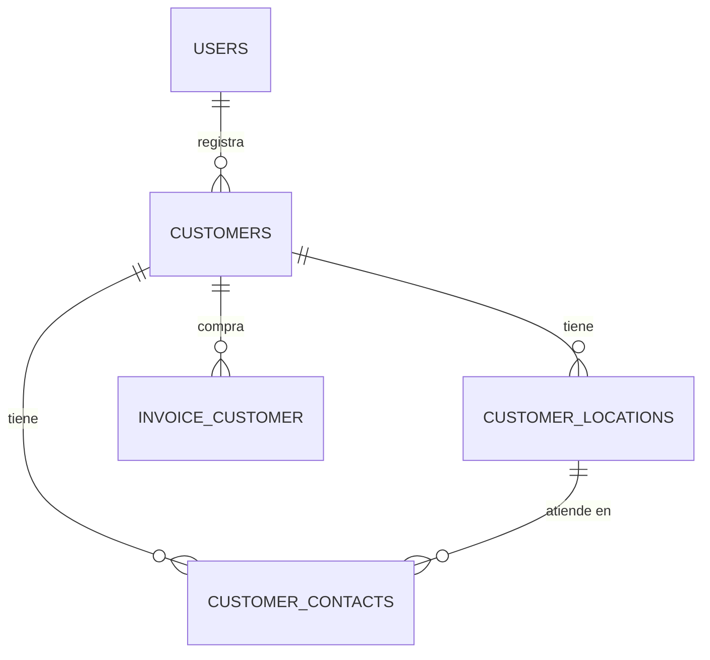

## OBJETO

### Establecer un contrato

No un contrato legal ni comercial, sino un pacto silencioso entre el negocio y su memoria. Un acuerdo que establece qué se recuerda, qué se olvida, qué se puede corregir y qué debe permanecer intocable. Cuando ese contrato se rompe, el sistema deja de ser confiable: se factura a fantasmas, las rutas de reparto apuntan a direcciones que ya no existen en el padrón, los contactos se duplican y las decisiones comerciales se toman a ciegas.

Este documento define las estructuras y los flujos que sostienen ese contrato para el registro, edición y baja lógica de **clientes** (personas naturales o jurídicas), de sus **locales y/o direcciones de entrega** (con referencia GPS para camiones de reparto y gestión de rutas) y de sus **contactos** (empleados alcanzables a nivel del cliente o de una sucursal concreta).

El contrato se apoya en cuatro promesas fundamentales:

1. **Nada se pierde.**  
   La historia comercial no se borra. Un cliente que deja de comprar no desaparece: cambia de estado. Una dirección de entrega sustituida no se destruye: se deshabilita y conserva el rastro de las ventas y rutas que la usaron.

2. **Nada se falsifica.**  
   Cada punto de entrega queda atado a coordenadas GPS y a un cliente. Un contacto declara a quién se llama, con qué cargo y a qué número. La ruta de reparto no inventa destinos: consume hechos del padrón.

3. **Nada se duplica.**  
   Un RUT/identificador tributario es uno. Una sucursal es una. Si el cliente o la dirección ya existen —aunque estén deshabilitados—, el sistema los reconoce y los reutiliza en lugar de crear gemelos que ensucien el padrón y confundan al despacho.

4. **Nada se destruye.**  
   La eliminación física es una tentación peligrosa. Este modelo la reemplaza por estados (`enabled`, `disabled`, `suspended`) que permiten retirar sin romper, ocultar sin olvidar, suspender sin condenar.

Estas promesas no son un lujo técnico. Son la condición para que el negocio pueda confiar en a quién vende, a dónde entrega y a quién llama.


## CONVENCIONES DEL MODELO

Estas reglas aplican a todas las tablas de este documento y a los tres motores soportados: **MariaDB**, **PostgreSQL** y **SQLite**. Son las mismas convenciones de los mantenedores de <a href="#/items/objeto">Artículos</a> y <a href="#/users/objeto">Usuarios</a>.

### Identificadores

Todas las claves primarias y foráneas usan **UUID** en formato canónico minúsculas (`xxxxxxxx-xxxx-4xxx-yxxx-xxxxxxxxxxxx`).

| Motor | Tipo | Default |
|-------|------|---------|
| MariaDB 10.7+ | `CHAR(36)` | `(UUID())` |
| PostgreSQL 13+ | `UUID` | `gen_random_uuid()` |
| SQLite | `TEXT` | expresión UUID v4 (ver abajo) |

Si el motor MariaDB es anterior a esas versiones, el UUID se genera en la aplicación.

**Expresión UUID v4 para SQLite:**

```sql
lower(hex(randomblob(4))) || '-' ||
lower(hex(randomblob(2))) || '-4' ||
substr(lower(hex(randomblob(2))), 2) || '-' ||
substr('89ab', 1 + (abs(random()) % 4), 1) ||
substr(lower(hex(randomblob(2))), 2) || '-' ||
lower(hex(randomblob(6)))
```

### Estado (`status`)

```text
'enabled' | 'disabled' | 'suspended'
```

El campo se llama siempre `status`. La baja es un cambio de estado; la reactivación reutiliza el registro existente.

### Integridad referencial

Las claves foráneas usan `ON DELETE RESTRICT`. Borrar un cliente en cascada rompería ventas (`invoice_customer` en el <a href="#/items/objeto">Mantenedor de Artículos</a>) y el historial de rutas.

En SQLite es obligatorio:

```sql
PRAGMA foreign_keys = ON;
```

### Timestamps

| Motor | `created_at` | `updated_at` |
|-------|--------------|--------------|
| MariaDB | `TIMESTAMP NOT NULL DEFAULT CURRENT_TIMESTAMP` | `TIMESTAMP NULL DEFAULT NULL ON UPDATE CURRENT_TIMESTAMP` |
| PostgreSQL | `TIMESTAMPTZ NOT NULL DEFAULT now()` | trigger `set_updated_at()` |
| SQLite | `TEXT NOT NULL DEFAULT (strftime('%Y-%m-%d %H:%M:%S', 'now'))` | trigger por tabla |

**PostgreSQL — función compartida** (crear una sola vez por base):

```sql
CREATE OR REPLACE FUNCTION set_updated_at()
RETURNS trigger AS $$
BEGIN
  NEW.updated_at = now();
  RETURN NEW;
END;
$$ LANGUAGE plpgsql;
```

### Usuario auditor

`user_id` es UUID y referencia `users(id)` (ver <a href="#/users/objeto">Mantenedor de Usuarios</a>). Aquí solo aparece como dependencia de auditoría de alta/edición.

### GPS y rutas

Las coordenadas se almacenan en **WGS84**:

| Campo | Rango | Semántica |
|-------|-------|-----------|
| `latitude` | −90 a 90 | Latitud decimal |
| `longitude` | −180 a 180 | Longitud decimal |

Tipos portables: `DECIMAL(9,6)` / `DECIMAL(10,6)` en MariaDB y PostgreSQL; `REAL` en SQLite con `CHECK` de rango. Un local o dirección de entrega **habilitado para despacho** debe tener ambas coordenadas. El motor de rutas (secuencia de paradas, ventanas horarias, flota) es una **decisión diferida**: este mantenedor solo garantiza el padrón georreferenciado que ese motor consumirá.

### Contactos: alcance cliente vs local

Un contacto pertenece siempre a un `customer_id`. Opcionalmente apunta a un `location_id`:

- `location_id` **nulo** → contacto del cliente en general (oficina central, dueño, administración).
- `location_id` **presente** → contacto de esa sucursal/local/dirección; el local debe ser del mismo cliente.

### Decisiones diferidas

- **Gestión de rutas multi-cliente** (orden de paradas, asignación de camiones, ETAs): documento futuro que consumirá `customer_locations`.
- **Validación tributaria formal del RUT/NIT** por país: la unicidad de `tax_id` es del contrato; el algoritmo de dígito verificador vive en la aplicación.
- **Historial de correcciones** de nombre o dirección: la promesa exige rastro; la tabla de auditoría se definirá aparte.


## PRIMERO: El Modelo



`INVOICE_CUSTOMER` se define en el <a href="#/items/objeto">Mantenedor de Artículos</a>; aquí solo se declara la dependencia.


## Tabla "customers"

### Propósito

Padrón maestro de clientes: personas **naturales** o **jurídicas** a las que el negocio vende. Es la raíz comercial que alimenta ventas, direcciones de entrega y contactos.

### Filosofía de diseño

El cliente es una identidad comercial estable. `party_type` discrimina la naturaleza jurídica sin partir el padrón en dos tablas: así `invoice_customer.customer_id` siempre apunta a un solo lugar.

- **Persona natural:** `name` es el nombre completo con el que se identifica ante el negocio.
- **Persona jurídica:** `name` es la razón social; `trade_name` (opcional) es el nombre de fantasía con el que opera en calle.

`tax_id` (RUT, NIT u otro identificador tributario según el país) es único. Si se intenta crear un cliente cuyo `tax_id` ya existe deshabilitado, el sistema podrá ofrecer reactivarlo.

Los clientes no se eliminan: `status` pasa a `disabled` o `suspended`, conservando ventas e historial de rutas.

### Descripción de la tabla

| Campo         | Descripción |
|---------------|-------------|
| `id`          | Identificador único (UUID) |
| `party_type`  | `natural` o `legal` |
| `name`        | Nombre completo o razón social |
| `trade_name`  | Nombre de fantasía; nulo en personas naturales o si no aplica |
| `tax_id`      | Identificador tributario (único) |
| `email`       | Correo general del cliente; nulo si no se conoce |
| `notes`       | Observaciones comerciales libres |
| `user_id`     | Usuario que creó el registro |
| `created_at`  | Fecha de creación |
| `updated_at`  | Fecha de la última modificación |
| `status`      | `enabled` / `disabled` / `suspended` |

### MariaDB

```sql
CREATE TABLE `customers` (
  `id` CHAR(36) NOT NULL DEFAULT (UUID()),
  `party_type` VARCHAR(20) NOT NULL,
  `name` VARCHAR(255) NOT NULL,
  `trade_name` VARCHAR(255) NULL,
  `tax_id` VARCHAR(64) NOT NULL,
  `email` VARCHAR(255) NULL,
  `notes` TEXT NULL,
  `user_id` CHAR(36) NOT NULL,
  `created_at` TIMESTAMP NOT NULL DEFAULT CURRENT_TIMESTAMP,
  `updated_at` TIMESTAMP NULL DEFAULT NULL ON UPDATE CURRENT_TIMESTAMP,
  `status` VARCHAR(20) NOT NULL DEFAULT 'enabled',
  PRIMARY KEY (`id`),
  UNIQUE (`tax_id`),
  CONSTRAINT `customers_party_type_check`
    CHECK (`party_type` IN ('natural', 'legal')),
  CONSTRAINT `customers_status_check`
    CHECK (`status` IN ('enabled', 'disabled', 'suspended')),
  CONSTRAINT `fk_customers_user`
    FOREIGN KEY (`user_id`) REFERENCES `users`(`id`) ON DELETE RESTRICT
);

INSERT INTO `customers` (
  `party_type`, `name`, `trade_name`, `tax_id`, `email`, `user_id`
) VALUES
  (
    'legal',
    'Distribuidora Los Andes SpA',
    'Los Andes Market',
    '76.123.456-7',
    'compras@losandes.example',
    '00000000-0000-4000-8000-000000000001'
  ),
  (
    'natural',
    'María Fernanda Soto Rojas',
    NULL,
    '12.345.678-9',
    'mfsoto@example.com',
    '00000000-0000-4000-8000-000000000001'
  );
```

### PostgreSQL

```sql
CREATE TABLE customers (
  id UUID PRIMARY KEY DEFAULT gen_random_uuid(),
  party_type TEXT NOT NULL
    CHECK (party_type IN ('natural', 'legal')),
  name VARCHAR(255) NOT NULL,
  trade_name VARCHAR(255),
  tax_id VARCHAR(64) NOT NULL,
  email VARCHAR(255),
  notes TEXT,
  user_id UUID NOT NULL REFERENCES users(id) ON DELETE RESTRICT,
  created_at TIMESTAMPTZ NOT NULL DEFAULT now(),
  updated_at TIMESTAMPTZ,
  status TEXT NOT NULL DEFAULT 'enabled'
    CHECK (status IN ('enabled', 'disabled', 'suspended')),
  CONSTRAINT customers_tax_id_unique UNIQUE (tax_id)
);

CREATE TRIGGER customers_set_updated_at
BEFORE UPDATE ON customers
FOR EACH ROW EXECUTE FUNCTION set_updated_at();
```

### SQLite

```sql
CREATE TABLE customers (
  id TEXT NOT NULL PRIMARY KEY DEFAULT (
    lower(hex(randomblob(4))) || '-' ||
    lower(hex(randomblob(2))) || '-4' ||
    substr(lower(hex(randomblob(2))), 2) || '-' ||
    substr('89ab', 1 + (abs(random()) % 4), 1) ||
    substr(lower(hex(randomblob(2))), 2) || '-' ||
    lower(hex(randomblob(6)))
  ),
  party_type TEXT NOT NULL
    CHECK (party_type IN ('natural', 'legal')),
  name TEXT NOT NULL,
  trade_name TEXT,
  tax_id TEXT NOT NULL UNIQUE,
  email TEXT,
  notes TEXT,
  user_id TEXT NOT NULL REFERENCES users(id) ON DELETE RESTRICT,
  created_at TEXT NOT NULL DEFAULT (strftime('%Y-%m-%d %H:%M:%S', 'now')),
  updated_at TEXT,
  status TEXT NOT NULL DEFAULT 'enabled'
    CHECK (status IN ('enabled', 'disabled', 'suspended'))
);

CREATE TRIGGER customers_set_updated_at
AFTER UPDATE ON customers
FOR EACH ROW
WHEN NEW.updated_at IS OLD.updated_at
BEGIN
  UPDATE customers
  SET updated_at = strftime('%Y-%m-%d %H:%M:%S', 'now')
  WHERE id = NEW.id;
END;
```

### Drizzle ORM (MariaDB)

```ts
import { mysqlTable, char, varchar, text, timestamp } from 'drizzle-orm/mysql-core';
import { sql } from 'drizzle-orm';

export const customers = mysqlTable('customers', {
  id: char('id', { length: 36 }).primaryKey().default(sql`(UUID())`),
  partyType: varchar('party_type', { length: 20 }).notNull(),
  name: varchar('name', { length: 255 }).notNull(),
  tradeName: varchar('trade_name', { length: 255 }),
  taxId: varchar('tax_id', { length: 64 }).notNull().unique(),
  email: varchar('email', { length: 255 }),
  notes: text('notes'),
  userId: char('user_id', { length: 36 }).notNull(),
  createdAt: timestamp('created_at').notNull().defaultNow(),
  updatedAt: timestamp('updated_at').onUpdateNow(),
  status: varchar('status', { length: 20 }).notNull().default('enabled'),
});
```


## Tabla "customer_locations"

### Propósito

Locales, sucursales y/o direcciones de entrega del cliente. Cada registro es un punto físico al que puede llegar un camión de reparto. Incluye referencia GPS para el sistema de gestión de rutas multi-cliente.

### Filosofía de diseño

Un cliente puede tener muchas ubicaciones: casa matriz, bodega, punto de venta, domicilio de despacho. `location_kind` tipifica el rol sin fragmentar el padrón:

```text
'branch'   — sucursal o local comercial
'delivery' — dirección de entrega / despacho
'other'    — otro punto relevante (bodega externa, feria, etc.)
```

La dirección textual (`address_line`, comuna/ciudad, región, país) es lo que lee un humano. `latitude` / `longitude` son lo que consume el ruteo. Ambos deben coexistir: sin texto se pierde operabilidad en terreno; sin GPS se pierde automatización de rutas.

Las ubicaciones no se eliminan. Si el cliente cierra una sucursal, `status` cambia a `disabled` o `suspended`. Las ventas y planificaciones históricas siguen resolviendo el punto.

### Descripción de la tabla

| Campo           | Descripción |
|-----------------|-------------|
| `id`            | Identificador único (UUID) |
| `customer_id`   | Cliente dueño del punto |
| `name`          | Etiqueta operativa (“Sucursal Centro”, “Bodega Norte”) |
| `location_kind` | `branch` / `delivery` / `other` |
| `address_line`  | Calle, número, depto/oficina |
| `city`          | Comuna o ciudad |
| `region`        | Región / estado / provincia |
| `postal_code`   | Código postal; nulo si no aplica |
| `country_code`  | ISO 3166-1 alpha-2 (`CL`, `AR`, …) |
| `latitude`      | Latitud WGS84 |
| `longitude`     | Longitud WGS84 |
| `delivery_notes`| Indicaciones al repartidor (portería, horario, etc.) |
| `user_id`       | Usuario que creó el registro |
| `created_at`    | Fecha de creación |
| `updated_at`    | Fecha de la última modificación |
| `status`        | Ciclo de vida del punto |

Unicidad práctica: el mismo cliente no debería repetir la misma etiqueta `name` activa. El contrato impone `UNIQUE (customer_id, name)`.

### MariaDB

```sql
CREATE TABLE `customer_locations` (
  `id` CHAR(36) NOT NULL DEFAULT (UUID()),
  `customer_id` CHAR(36) NOT NULL,
  `name` VARCHAR(255) NOT NULL,
  `location_kind` VARCHAR(20) NOT NULL DEFAULT 'delivery',
  `address_line` VARCHAR(255) NOT NULL,
  `city` VARCHAR(120) NOT NULL,
  `region` VARCHAR(120) NOT NULL,
  `postal_code` VARCHAR(32) NULL,
  `country_code` CHAR(2) NOT NULL DEFAULT 'CL',
  `latitude` DECIMAL(9,6) NOT NULL,
  `longitude` DECIMAL(10,6) NOT NULL,
  `delivery_notes` TEXT NULL,
  `user_id` CHAR(36) NOT NULL,
  `created_at` TIMESTAMP NOT NULL DEFAULT CURRENT_TIMESTAMP,
  `updated_at` TIMESTAMP NULL DEFAULT NULL ON UPDATE CURRENT_TIMESTAMP,
  `status` VARCHAR(20) NOT NULL DEFAULT 'enabled',
  PRIMARY KEY (`id`),
  UNIQUE (`customer_id`, `name`),
  INDEX `idx_customer_locations_customer` (`customer_id`),
  INDEX `idx_customer_locations_geo` (`latitude`, `longitude`),
  CONSTRAINT `customer_locations_kind_check`
    CHECK (`location_kind` IN ('branch', 'delivery', 'other')),
  CONSTRAINT `customer_locations_status_check`
    CHECK (`status` IN ('enabled', 'disabled', 'suspended')),
  CONSTRAINT `customer_locations_lat_check`
    CHECK (`latitude` >= -90 AND `latitude` <= 90),
  CONSTRAINT `customer_locations_lng_check`
    CHECK (`longitude` >= -180 AND `longitude` <= 180),
  CONSTRAINT `fk_customer_locations_customer`
    FOREIGN KEY (`customer_id`) REFERENCES `customers`(`id`) ON DELETE RESTRICT,
  CONSTRAINT `fk_customer_locations_user`
    FOREIGN KEY (`user_id`) REFERENCES `users`(`id`) ON DELETE RESTRICT
);
```

### PostgreSQL

```sql
CREATE TABLE customer_locations (
  id UUID PRIMARY KEY DEFAULT gen_random_uuid(),
  customer_id UUID NOT NULL REFERENCES customers(id) ON DELETE RESTRICT,
  name VARCHAR(255) NOT NULL,
  location_kind TEXT NOT NULL DEFAULT 'delivery'
    CHECK (location_kind IN ('branch', 'delivery', 'other')),
  address_line VARCHAR(255) NOT NULL,
  city VARCHAR(120) NOT NULL,
  region VARCHAR(120) NOT NULL,
  postal_code VARCHAR(32),
  country_code CHAR(2) NOT NULL DEFAULT 'CL',
  latitude NUMERIC(9,6) NOT NULL
    CHECK (latitude >= -90 AND latitude <= 90),
  longitude NUMERIC(10,6) NOT NULL
    CHECK (longitude >= -180 AND longitude <= 180),
  delivery_notes TEXT,
  user_id UUID NOT NULL REFERENCES users(id) ON DELETE RESTRICT,
  created_at TIMESTAMPTZ NOT NULL DEFAULT now(),
  updated_at TIMESTAMPTZ,
  status TEXT NOT NULL DEFAULT 'enabled'
    CHECK (status IN ('enabled', 'disabled', 'suspended')),
  CONSTRAINT customer_locations_customer_name_unique UNIQUE (customer_id, name)
);

CREATE INDEX idx_customer_locations_customer ON customer_locations (customer_id);
CREATE INDEX idx_customer_locations_geo ON customer_locations (latitude, longitude);

CREATE TRIGGER customer_locations_set_updated_at
BEFORE UPDATE ON customer_locations
FOR EACH ROW EXECUTE FUNCTION set_updated_at();
```

### SQLite

```sql
CREATE TABLE customer_locations (
  id TEXT NOT NULL PRIMARY KEY DEFAULT (
    lower(hex(randomblob(4))) || '-' ||
    lower(hex(randomblob(2))) || '-4' ||
    substr(lower(hex(randomblob(2))), 2) || '-' ||
    substr('89ab', 1 + (abs(random()) % 4), 1) ||
    substr(lower(hex(randomblob(2))), 2) || '-' ||
    lower(hex(randomblob(6)))
  ),
  customer_id TEXT NOT NULL REFERENCES customers(id) ON DELETE RESTRICT,
  name TEXT NOT NULL,
  location_kind TEXT NOT NULL DEFAULT 'delivery'
    CHECK (location_kind IN ('branch', 'delivery', 'other')),
  address_line TEXT NOT NULL,
  city TEXT NOT NULL,
  region TEXT NOT NULL,
  postal_code TEXT,
  country_code TEXT NOT NULL DEFAULT 'CL',
  latitude REAL NOT NULL
    CHECK (latitude >= -90 AND latitude <= 90),
  longitude REAL NOT NULL
    CHECK (longitude >= -180 AND longitude <= 180),
  delivery_notes TEXT,
  user_id TEXT NOT NULL REFERENCES users(id) ON DELETE RESTRICT,
  created_at TEXT NOT NULL DEFAULT (strftime('%Y-%m-%d %H:%M:%S', 'now')),
  updated_at TEXT,
  status TEXT NOT NULL DEFAULT 'enabled'
    CHECK (status IN ('enabled', 'disabled', 'suspended')),
  UNIQUE (customer_id, name)
);

CREATE INDEX idx_customer_locations_customer ON customer_locations (customer_id);
CREATE INDEX idx_customer_locations_geo ON customer_locations (latitude, longitude);

CREATE TRIGGER customer_locations_set_updated_at
AFTER UPDATE ON customer_locations
FOR EACH ROW
WHEN NEW.updated_at IS OLD.updated_at
BEGIN
  UPDATE customer_locations
  SET updated_at = strftime('%Y-%m-%d %H:%M:%S', 'now')
  WHERE id = NEW.id;
END;
```


## Tabla "customer_contacts"

### Propósito

Personas de contacto vinculadas al cliente en general o a una sucursal/local/dirección concreta. Soportan la operación comercial y de despacho: a quién llamar, con qué cargo y a qué número.

### Filosofía de diseño

Un contacto no es un usuario del sistema: es un interlocutor del cliente. Los campos mínimos del contrato son:

- **Nombre del empleado** (`full_name`)
- **Cargo** (`job_title`)
- **Número de teléfono** (`phone`)

El alcance se modela así:

| Situación | `customer_id` | `location_id` |
|-----------|---------------|---------------|
| Contacto general del cliente | obligatorio | `NULL` |
| Contacto de una sucursal/dirección | obligatorio | UUID del local |

Cuando `location_id` está presente, debe pertenecer al mismo `customer_id`. Esa invariante se valida en la aplicación (y puede reforzarse con triggers). No se crean contactos huérfanos ni contactos “de otro cliente” colgados de un local ajeno.

Los contactos no se eliminan: cambian de `status`. Si la persona cambia de cargo o de teléfono, se actualiza el registro (y, cuando exista, el historial de correcciones dejará rastro).

### Descripción de la tabla

| Campo          | Descripción |
|----------------|-------------|
| `id`           | Identificador único (UUID) |
| `customer_id`  | Cliente al que pertenece |
| `location_id`  | Local/dirección; nulo = contacto general |
| `full_name`    | Nombre del empleado / interlocutor |
| `job_title`    | Cargo (Jefe de bodega, Comprador, etc.) |
| `phone`        | Número de teléfono de contacto |
| `email`        | Correo opcional del contacto |
| `notes`        | Observaciones (horario de llamado, etc.) |
| `user_id`      | Usuario que creó el registro |
| `created_at`   | Fecha de creación |
| `updated_at`   | Fecha de la última modificación |
| `status`       | Ciclo de vida del contacto |

### MariaDB

```sql
CREATE TABLE `customer_contacts` (
  `id` CHAR(36) NOT NULL DEFAULT (UUID()),
  `customer_id` CHAR(36) NOT NULL,
  `location_id` CHAR(36) NULL,
  `full_name` VARCHAR(255) NOT NULL,
  `job_title` VARCHAR(120) NOT NULL,
  `phone` VARCHAR(64) NOT NULL,
  `email` VARCHAR(255) NULL,
  `notes` TEXT NULL,
  `user_id` CHAR(36) NOT NULL,
  `created_at` TIMESTAMP NOT NULL DEFAULT CURRENT_TIMESTAMP,
  `updated_at` TIMESTAMP NULL DEFAULT NULL ON UPDATE CURRENT_TIMESTAMP,
  `status` VARCHAR(20) NOT NULL DEFAULT 'enabled',
  PRIMARY KEY (`id`),
  INDEX `idx_customer_contacts_customer` (`customer_id`),
  INDEX `idx_customer_contacts_location` (`location_id`),
  CONSTRAINT `customer_contacts_status_check`
    CHECK (`status` IN ('enabled', 'disabled', 'suspended')),
  CONSTRAINT `fk_customer_contacts_customer`
    FOREIGN KEY (`customer_id`) REFERENCES `customers`(`id`) ON DELETE RESTRICT,
  CONSTRAINT `fk_customer_contacts_location`
    FOREIGN KEY (`location_id`) REFERENCES `customer_locations`(`id`) ON DELETE RESTRICT,
  CONSTRAINT `fk_customer_contacts_user`
    FOREIGN KEY (`user_id`) REFERENCES `users`(`id`) ON DELETE RESTRICT
);
```

### PostgreSQL

```sql
CREATE TABLE customer_contacts (
  id UUID PRIMARY KEY DEFAULT gen_random_uuid(),
  customer_id UUID NOT NULL REFERENCES customers(id) ON DELETE RESTRICT,
  location_id UUID REFERENCES customer_locations(id) ON DELETE RESTRICT,
  full_name VARCHAR(255) NOT NULL,
  job_title VARCHAR(120) NOT NULL,
  phone VARCHAR(64) NOT NULL,
  email VARCHAR(255),
  notes TEXT,
  user_id UUID NOT NULL REFERENCES users(id) ON DELETE RESTRICT,
  created_at TIMESTAMPTZ NOT NULL DEFAULT now(),
  updated_at TIMESTAMPTZ,
  status TEXT NOT NULL DEFAULT 'enabled'
    CHECK (status IN ('enabled', 'disabled', 'suspended'))
);

CREATE INDEX idx_customer_contacts_customer ON customer_contacts (customer_id);
CREATE INDEX idx_customer_contacts_location ON customer_contacts (location_id);

CREATE TRIGGER customer_contacts_set_updated_at
BEFORE UPDATE ON customer_contacts
FOR EACH ROW EXECUTE FUNCTION set_updated_at();
```

### SQLite

```sql
CREATE TABLE customer_contacts (
  id TEXT NOT NULL PRIMARY KEY DEFAULT (
    lower(hex(randomblob(4))) || '-' ||
    lower(hex(randomblob(2))) || '-4' ||
    substr(lower(hex(randomblob(2))), 2) || '-' ||
    substr('89ab', 1 + (abs(random()) % 4), 1) ||
    substr(lower(hex(randomblob(2))), 2) || '-' ||
    lower(hex(randomblob(6)))
  ),
  customer_id TEXT NOT NULL REFERENCES customers(id) ON DELETE RESTRICT,
  location_id TEXT REFERENCES customer_locations(id) ON DELETE RESTRICT,
  full_name TEXT NOT NULL,
  job_title TEXT NOT NULL,
  phone TEXT NOT NULL,
  email TEXT,
  notes TEXT,
  user_id TEXT NOT NULL REFERENCES users(id) ON DELETE RESTRICT,
  created_at TEXT NOT NULL DEFAULT (strftime('%Y-%m-%d %H:%M:%S', 'now')),
  updated_at TEXT,
  status TEXT NOT NULL DEFAULT 'enabled'
    CHECK (status IN ('enabled', 'disabled', 'suspended'))
);

CREATE INDEX idx_customer_contacts_customer ON customer_contacts (customer_id);
CREATE INDEX idx_customer_contacts_location ON customer_contacts (location_id);

CREATE TRIGGER customer_contacts_set_updated_at
AFTER UPDATE ON customer_contacts
FOR EACH ROW
WHEN NEW.updated_at IS OLD.updated_at
BEGIN
  UPDATE customer_contacts
  SET updated_at = strftime('%Y-%m-%d %H:%M:%S', 'now')
  WHERE id = NEW.id;
END;
```


## Flujos

### Alta de cliente (persona jurídica o natural)

1. Capturar `party_type`, `name`, `tax_id` (y `trade_name` si es jurídica).  
2. Si `tax_id` ya existe `enabled` → rechazo (nada se duplica).  
3. Si existe `disabled`/`suspended` → ofrecer reactivación.  
4. Insertar `customers` con `user_id` del operador.

### Alta de local / dirección de entrega

1. Elegir cliente `enabled`.  
2. Registrar etiqueta, tipo (`branch` / `delivery` / `other`), dirección textual y GPS.  
3. Opcional: `delivery_notes` para el repartidor.  
4. Insertar `customer_locations`.

### Alta de contacto

1. Elegir cliente.  
2. Si el contacto es de una sucursal, elegir `location_id` de ese cliente; si es general, dejar `location_id` nulo.  
3. Registrar `full_name`, `job_title`, `phone`.  
4. Insertar `customer_contacts`.

### Baja lógica

Cambiar `status` del cliente, del local o del contacto. No borrar filas. Un cliente `disabled` no debería aceptarse en nuevas ventas; sus puntos GPS siguen disponibles para auditoría de rutas pasadas.

### Consulta — cliente con locales habilitados (insumo de rutas)

```sql
SELECT
  c.id AS customer_id,
  c.name AS customer_name,
  c.trade_name,
  c.tax_id,
  l.id AS location_id,
  l.name AS location_name,
  l.location_kind,
  l.address_line,
  l.city,
  l.region,
  l.latitude,
  l.longitude,
  l.delivery_notes
FROM customers c
JOIN customer_locations l ON l.customer_id = c.id
WHERE c.status = 'enabled'
  AND l.status = 'enabled'
ORDER BY c.name, l.name;
```

### Consulta — puntos GPS en una caja geográfica (ventana de ruta)

```sql
SELECT
  l.id,
  c.name AS customer_name,
  l.name AS location_name,
  l.latitude,
  l.longitude,
  l.address_line,
  l.city
FROM customer_locations l
JOIN customers c ON c.id = l.customer_id
WHERE l.status = 'enabled'
  AND c.status = 'enabled'
  AND l.latitude BETWEEN :lat_min AND :lat_max
  AND l.longitude BETWEEN :lng_min AND :lng_max;
```

### Consulta — contactos de un cliente (generales y por local)

```sql
SELECT
  ct.id,
  ct.full_name,
  ct.job_title,
  ct.phone,
  ct.email,
  CASE
    WHEN ct.location_id IS NULL THEN 'customer'
    ELSE 'location'
  END AS scope,
  l.name AS location_name
FROM customer_contacts ct
LEFT JOIN customer_locations l ON l.id = ct.location_id
WHERE ct.customer_id = :customer_id
  AND ct.status = 'enabled'
ORDER BY scope, l.name, ct.full_name;
```

### Consulta — a quién llamar en un punto de entrega

```sql
SELECT
  ct.full_name,
  ct.job_title,
  ct.phone,
  ct.email
FROM customer_contacts ct
WHERE ct.location_id = :location_id
  AND ct.status = 'enabled'
ORDER BY ct.full_name;
```


## Orden de migración sugerido

1. `users` (<a href="#/users/objeto">Mantenedor de Usuarios</a>)  
2. `customers`  
3. `customer_locations`  
4. `customer_contacts`  
5. Consumidores externos: `invoice_customer` (<a href="#/items/objeto">Mantenedor de Artículos</a>), futuro motor de rutas  

## Relación con otros mantenedores

| Mantenedor | Uso de este padrón |
|------------|--------------------|
| <a href="#/items/objeto">Artículos</a> | `invoice_customer.customer_id` → `customers.id` |
| <a href="#/users/objeto">Usuarios</a> | `user_id` de auditoría en altas |
| <a href="#/suppliers/objeto">Proveedores</a> | Espejo conceptual (venta vs compra); no comparten filas |
| Futuro: rutas | Consume `customer_locations` (GPS + notas de entrega) y `customer_contacts` (aviso de llegada) |
