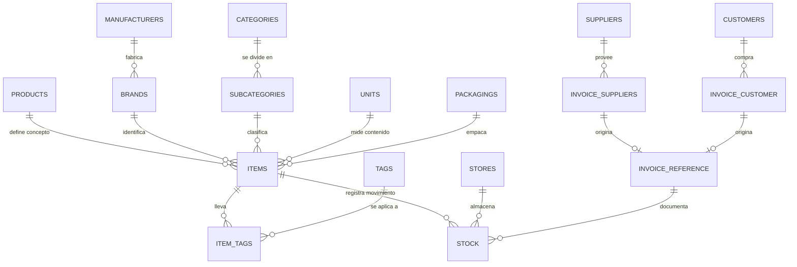

## OBJETO

### Establecer un contrato

No un contrato legal ni comercial, sino un pacto silencioso entre el negocio y su memoria. Un acuerdo que establece qué se recuerda, qué se olvida, qué se puede corregir y qué debe permanecer intocable. Cuando ese contrato se rompe, el sistema deja de ser confiable: los números no cuadran, los reportes mienten, el inventario se vuelve una ficción y las decisiones se toman a ciegas.

Este documento define las estructuras y los flujos que sostienen ese contrato para el registro, edición y eliminación de artículos, así como para el ingreso y egreso de existencias, el control de inventario y sus ajustes.

El contrato se apoya en cuatro promesas fundamentales:

1. **Nada se pierde.**  
   La historia del negocio no se borra. Un artículo que deja de venderse no desaparece: cambia de estado. Una venta pasada no se reescribe: se conserva. Un nombre mal escrito no se sobrescribe sin dejar rastro: se corrige con registro.

2. **Nada se falsifica.**  
   Cada movimiento de inventario queda atado a un documento, a un usuario y a una fecha. El stock no es una opinión: es la suma de hechos registrados.

3. **Nada se duplica.**  
   Un concepto es un concepto. Una marca es una marca. Si algo ya existe —aunque esté deshabilitado—, el sistema lo reconoce y lo reutiliza en lugar de crear un gemelo que ensucie el catálogo.

4. **Nada se destruye.**  
   La eliminación física es una tentación peligrosa. Este modelo la reemplaza por estados (`enabled`, `disabled`, `suspended`) que permiten retirar sin romper, ocultar sin olvidar, suspender sin condenar.

Estas promesas no son un lujo técnico. Son la condición para que el negocio pueda confiar en su propio reflejo digital.


## CONVENCIONES DEL MODELO

Estas reglas aplican a todas las tablas de este documento y a los tres motores soportados: **MySQL/MariaDB**, **PostgreSQL** y **SQLite**.

### Identificadores

Todas las claves primarias y foráneas usan **UUID** en formato canónico minúsculas (`xxxxxxxx-xxxx-4xxx-yxxx-xxxxxxxxxxxx`).

| Motor | Tipo | Default |
|-------|------|---------|
| MySQL 8.0.13+ / MariaDB 10.7+ | `CHAR(36)` | `(UUID())` |
| PostgreSQL 13+ | `UUID` | `gen_random_uuid()` |
| SQLite | `TEXT` | expresión UUID v4 (ver abajo) |

Si el motor MySQL/MariaDB es anterior a esas versiones, el UUID se genera en la aplicación.

**Expresión UUID v4 para SQLite** (reutilizada en todos los `CREATE`):

```sql
lower(hex(randomblob(4))) || '-' ||
lower(hex(randomblob(2))) || '-4' ||
substr(lower(hex(randomblob(2))), 2) || '-' ||
substr('89ab', 1 + (abs(random()) % 4), 1) ||
substr(lower(hex(randomblob(2))), 2) || '-' ||
lower(hex(randomblob(6)))
```

En los DDL de SQLite de este documento se abrevia como `/* uuid_v4 */` cuando el espacio lo pide; la expresión completa es la de arriba.

### Estado (`status`)

Un solo vocabulario en todo el catálogo y en los hechos:

```text
'enabled' | 'disabled' | 'suspended'
```

El campo se llama siempre `status` (nunca `active`). La baja es un cambio de estado; la reactivación reutiliza el registro existente.

En los tres motores el dominio se expresa con `CHECK` (portable). MySQL/MariaDB puede usar `ENUM` como alternativa nativa; este documento prioriza `VARCHAR`/`TEXT` + `CHECK` para un contrato mental único.

### Integridad referencial

Las claves foráneas usan `ON DELETE RESTRICT`. Borrar en cascada hechos de inventario o documentos rompería las promesas del contrato. La baja lógica (`status`) es el único retiro permitido.

En SQLite es obligatorio:

```sql
PRAGMA foreign_keys = ON;
```

### Timestamps

| Motor | `created_at` | `updated_at` |
|-------|--------------|--------------|
| MySQL/MariaDB | `TIMESTAMP NOT NULL DEFAULT CURRENT_TIMESTAMP` | `TIMESTAMP NULL DEFAULT NULL ON UPDATE CURRENT_TIMESTAMP` |
| PostgreSQL | `TIMESTAMPTZ NOT NULL DEFAULT now()` | trigger `set_updated_at()` |
| SQLite | `TEXT NOT NULL DEFAULT (strftime('%Y-%m-%d %H:%M:%S', 'now'))` | trigger por tabla |

**PostgreSQL — función compartida** (crear una sola vez por base):

```sql
CREATE OR REPLACE FUNCTION set_updated_at()
RETURNS trigger AS $$
BEGIN
  NEW.updated_at = now();
  RETURN NEW;
END;
$$ LANGUAGE plpgsql;
```

**SQLite — plantilla de trigger** (una por tabla; el nombre debe coincidir con la tabla):

```sql
CREATE TRIGGER products_set_updated_at
AFTER UPDATE ON products
FOR EACH ROW
WHEN NEW.updated_at IS OLD.updated_at
BEGIN
  UPDATE products
  SET updated_at = strftime('%Y-%m-%d %H:%M:%S', 'now')
  WHERE id = NEW.id;
END;
```

### Precio y cantidades

- `price` y montos monetarios: enteros en la unidad mínima de la moneda.
- `stock.quantity`: entero estricto `> 0`. El sentido del movimiento (entrada/salida) lo determina el documento en `invoice_reference`, no un signo ni una columna `type` en `stock`.

### Usuario auditor

`user_id` es UUID y referencia `users(id)`. La tabla `users` se documenta en el <a href="#/users/objeto">Mantenedor de Usuarios</a>; aquí solo aparece como dependencia de auditoría.

### Decisiones diferidas

- **Vencimientos / lotes:** una misma presentación puede recibir compras con distintos vencimientos. Se modelará en un documento futuro de lotes, no como campo de `items`.
- **Historial de correcciones ortográficas:** la promesa exige rastro; la tabla de auditoría de renombres se definirá en su propio documento.


## PRIMERO: El Modelo




## Tabla "products"

### Propósito

Esta tabla contiene el catálogo maestro del sistema: almacena el concepto base de cada producto, independiente de su marca, fabricante, presentación, formato comercial o cualquier otra característica específica. Cada registro representa un concepto único dentro del negocio; por ello, el campo `name` es único y define la identidad del producto. Los detalles comerciales y las variantes se administran en la tabla `items`.

### Filosofía de diseño

`products` no representa un artículo comercial, sino el concepto sobre el cual se construye el catálogo. Esta separación permite reutilizar un mismo producto en múltiples artículos comerciales, evitando duplicidad de información y facilitando reportes, estadísticas e inventario.

**Farmacia**

Producto: Ibuprofeno. Items: Ibuprofeno 400 mg, Ibuprofeno 600 mg, Actron 400 mg. Todos pertenecen al mismo producto: el ibuprofeno.

**Almacén**

Producto: Papas fritas. Items: Papas Fritas Tim 150 g, Papas Fritas Marco Polo 150 g, Papas Fritas Evercrisp 250 g. El concepto no cambia; cambian marca y presentación.

**Verdulería**

Producto: Limón. Items: Limón Eureka, Limón Sutil, Limón Meyer, Limón de Pica. Aunque a veces haya un solo artículo por producto, mantener la separación conserva una estructura uniforme en todos los rubros. Si el productor no tiene marca comercial, el ítem usa la marca `General` de ese fabricante.

### Identidad del producto

El nombre en `products` es la identidad y no debe cambiar de significado. Si el ibuprofeno pasara a llamarse "paracetamol", sería un producto nuevo: se crea un registro nuevo y se conserva el anterior.

### Corrección de nombres

Como única excepción, un administrador podrá corregir errores ortográficos o tipográficos (Ibufrofeno → Ibuprofeno). Esas correcciones no alteran la identidad y quedarán registradas en el historial del sistema.

### Baja de productos

Los productos no se eliminan. Cuando dejan de utilizarse, `status` pasa a `disabled` o `suspended`. Si un usuario intenta crear un producto cuyo nombre ya existe deshabilitado, el sistema podrá ofrecer reactivarlo.

### Descripción de la tabla

| Campo         | Descripción                         |
|---------------|-------------------------------------|
| `id`          | Identificador único (UUID)          |
| `name`        | Nombre del producto (único)         |
| `description` | Descripción opcional                |
| `created_at`  | Fecha de creación                   |
| `updated_at`  | Fecha de la última modificación     |
| `status`      | `enabled` / `disabled` / `suspended`|

### MySQL / MariaDB

```sql
CREATE TABLE `products` (
  `id` CHAR(36) NOT NULL DEFAULT (UUID()),
  `name` VARCHAR(255) NOT NULL,
  `description` TEXT NULL,
  `created_at` TIMESTAMP NOT NULL DEFAULT CURRENT_TIMESTAMP,
  `updated_at` TIMESTAMP NULL DEFAULT NULL ON UPDATE CURRENT_TIMESTAMP,
  `status` VARCHAR(20) NOT NULL DEFAULT 'enabled',
  PRIMARY KEY (`id`),
  UNIQUE (`name`),
  CONSTRAINT `products_status_check`
    CHECK (`status` IN ('enabled', 'disabled', 'suspended'))
);

INSERT INTO `products` (`name`, `description`) VALUES (
  'chocolate',
  'El chocolate (del náhuatl, xocoatl) es el alimento que se obtiene mezclando azúcar con dos productos que derivan de la manipulación de las semillas del cacao: la masa del cacao y la manteca de cacao'
);
```

### PostgreSQL

```sql
CREATE TABLE products (
  id UUID PRIMARY KEY DEFAULT gen_random_uuid(),
  name VARCHAR(255) NOT NULL,
  description TEXT,
  created_at TIMESTAMPTZ NOT NULL DEFAULT now(),
  updated_at TIMESTAMPTZ,
  status TEXT NOT NULL DEFAULT 'enabled'
    CHECK (status IN ('enabled', 'disabled', 'suspended')),
  CONSTRAINT products_name_unique UNIQUE (name)
);

CREATE TRIGGER products_set_updated_at
BEFORE UPDATE ON products
FOR EACH ROW EXECUTE FUNCTION set_updated_at();
```

### SQLite

```sql
CREATE TABLE products (
  id TEXT NOT NULL PRIMARY KEY DEFAULT (
    lower(hex(randomblob(4))) || '-' ||
    lower(hex(randomblob(2))) || '-4' ||
    substr(lower(hex(randomblob(2))), 2) || '-' ||
    substr('89ab', 1 + (abs(random()) % 4), 1) ||
    substr(lower(hex(randomblob(2))), 2) || '-' ||
    lower(hex(randomblob(6)))
  ),
  name TEXT NOT NULL,
  description TEXT,
  created_at TEXT NOT NULL DEFAULT (strftime('%Y-%m-%d %H:%M:%S', 'now')),
  updated_at TEXT,
  status TEXT NOT NULL DEFAULT 'enabled'
    CHECK (status IN ('enabled', 'disabled', 'suspended')),
  UNIQUE (name)
);

CREATE TRIGGER products_set_updated_at
AFTER UPDATE ON products
FOR EACH ROW
WHEN NEW.updated_at IS OLD.updated_at
BEGIN
  UPDATE products
  SET updated_at = strftime('%Y-%m-%d %H:%M:%S', 'now')
  WHERE id = NEW.id;
END;
```

### Drizzle ORM (MySQL)

```ts
import { mysqlTable, char, varchar, timestamp, text, unique } from 'drizzle-orm/mysql-core';
import { sql } from 'drizzle-orm';

export const products = mysqlTable('products', {
  id: char('id', { length: 36 }).primaryKey().default(sql`(UUID())`),
  name: varchar('name', { length: 255 }).notNull().unique(),
  description: text('description'),
  createdAt: timestamp('created_at').notNull().defaultNow(),
  updatedAt: timestamp('updated_at').onUpdateNow(),
  status: varchar('status', { length: 20 }).notNull().default('enabled'),
});
```


## Tabla "manufacturers"

### Propósito

Listado de fabricantes: personas naturales o entidades jurídicas responsables de producir, transformar, extraer o ensamblar el bien físico que se comercializa. Su función es otorgarle al artículo una identidad productiva; la identidad visible para el consumidor se gestiona en `brands`.

### Filosofía de diseño

La marca es el rostro que ve el cliente (Marco Polo, Truper, Merck). El fabricante es quien opera la línea de producción (ICB S.A., Truper S.A. de C.V., Merck Serono S.A.). Aunque esta tabla tendrá poco movimiento, permite responder "¿qué laboratorio vende más?" o "¿qué fabricante tiene mejor rotación?". El proveedor del software podrá ofrecer datos precargados por país o región.

**Regla de alta:** al crear un fabricante se crea automáticamente su marca por defecto `General` (única por laboratorio). Todo artículo “sin marca comercial” usa esa marca `General` del fabricante correspondiente.

### Descripción de la tabla

| Campo        | Descripción                          |
|--------------|--------------------------------------|
| `id`         | Identificador único (UUID)           |
| `name`       | Nombre del fabricante (único)        |
| `created_at` | Fecha de creación                    |
| `updated_at` | Fecha de la última modificación      |
| `status`     | `enabled` / `disabled` / `suspended` |

### MySQL / MariaDB

```sql
CREATE TABLE `manufacturers` (
  `id` CHAR(36) NOT NULL DEFAULT (UUID()),
  `name` VARCHAR(255) NOT NULL,
  `created_at` TIMESTAMP NOT NULL DEFAULT CURRENT_TIMESTAMP,
  `updated_at` TIMESTAMP NULL DEFAULT NULL ON UPDATE CURRENT_TIMESTAMP,
  `status` VARCHAR(20) NOT NULL DEFAULT 'enabled',
  PRIMARY KEY (`id`),
  UNIQUE (`name`),
  CONSTRAINT `manufacturers_status_check`
    CHECK (`status` IN ('enabled', 'disabled', 'suspended'))
);
```

### PostgreSQL

```sql
CREATE TABLE manufacturers (
  id UUID PRIMARY KEY DEFAULT gen_random_uuid(),
  name VARCHAR(255) NOT NULL,
  created_at TIMESTAMPTZ NOT NULL DEFAULT now(),
  updated_at TIMESTAMPTZ,
  status TEXT NOT NULL DEFAULT 'enabled'
    CHECK (status IN ('enabled', 'disabled', 'suspended')),
  CONSTRAINT manufacturers_name_unique UNIQUE (name)
);

CREATE TRIGGER manufacturers_set_updated_at
BEFORE UPDATE ON manufacturers
FOR EACH ROW EXECUTE FUNCTION set_updated_at();
```

### SQLite

```sql
CREATE TABLE manufacturers (
  id TEXT NOT NULL PRIMARY KEY DEFAULT (
    lower(hex(randomblob(4))) || '-' ||
    lower(hex(randomblob(2))) || '-4' ||
    substr(lower(hex(randomblob(2))), 2) || '-' ||
    substr('89ab', 1 + (abs(random()) % 4), 1) ||
    substr(lower(hex(randomblob(2))), 2) || '-' ||
    lower(hex(randomblob(6)))
  ),
  name TEXT NOT NULL UNIQUE,
  created_at TEXT NOT NULL DEFAULT (strftime('%Y-%m-%d %H:%M:%S', 'now')),
  updated_at TEXT,
  status TEXT NOT NULL DEFAULT 'enabled'
    CHECK (status IN ('enabled', 'disabled', 'suspended'))
);

CREATE TRIGGER manufacturers_set_updated_at
AFTER UPDATE ON manufacturers
FOR EACH ROW
WHEN NEW.updated_at IS OLD.updated_at
BEGIN
  UPDATE manufacturers
  SET updated_at = strftime('%Y-%m-%d %H:%M:%S', 'now')
  WHERE id = NEW.id;
END;
```


## Tabla "brands"

### Propósito

Listado de marcas comerciales. Asocia cada artículo de `items` con su marca. A diferencia del fabricante, la marca es la identidad visible con la que el producto llega al consumidor.

### Filosofía de diseño

**Toda marca tiene fabricante** (`manufacturer_id` obligatorio). **Todo fabricante tiene al menos la marca `General`**. El nombre de marca es único **dentro** del fabricante: `UNIQUE (manufacturer_id, name)`, de modo que Merck y Opko pueden tener cada uno su `General`.

Cuando el artículo no tiene rostro comercial (genérico Cenabast, limón de un productor), no se deja `brand_id` nulo: se usa la marca `General` de ese fabricante. Si el laboratorio aún no está en el padrón, se crea primero en `manufacturers` (con su `General` automática) y después las marcas comerciales adicionales (Artren, FlexFull, Diclotaren, …).

### Descripción de la tabla

| Campo             | Descripción                                      |
|-------------------|--------------------------------------------------|
| `id`              | Identificador único (UUID)                       |
| `name`            | Nombre de la marca (único por fabricante)        |
| `manufacturer_id` | Fabricante (obligatorio)                         |
| `user_id`         | Usuario que creó el registro                     |
| `created_at`      | Fecha de creación                                |
| `updated_at`      | Fecha de la última modificación                  |
| `status`          | `enabled` / `disabled` / `suspended`             |

### MySQL / MariaDB

```sql
CREATE TABLE `brands` (
  `id` CHAR(36) NOT NULL DEFAULT (UUID()),
  `name` VARCHAR(255) NOT NULL,
  `manufacturer_id` CHAR(36) NOT NULL,
  `user_id` CHAR(36) NOT NULL,
  `created_at` TIMESTAMP NOT NULL DEFAULT CURRENT_TIMESTAMP,
  `updated_at` TIMESTAMP NULL DEFAULT NULL ON UPDATE CURRENT_TIMESTAMP,
  `status` VARCHAR(20) NOT NULL DEFAULT 'enabled',
  PRIMARY KEY (`id`),
  UNIQUE (`manufacturer_id`, `name`),
  CONSTRAINT `brands_status_check`
    CHECK (`status` IN ('enabled', 'disabled', 'suspended')),
  CONSTRAINT `fk_brands_manufacturer`
    FOREIGN KEY (`manufacturer_id`) REFERENCES `manufacturers`(`id`) ON DELETE RESTRICT,
  CONSTRAINT `fk_brands_user`
    FOREIGN KEY (`user_id`) REFERENCES `users`(`id`) ON DELETE RESTRICT
);

-- Tras crear manufacturers, cada uno recibe su marca General (regla de alta).
INSERT INTO `brands` (`name`, `manufacturer_id`, `user_id`) VALUES
  ('General', '00000000-0000-4000-8000-000000000010', '00000000-0000-4000-8000-000000000001'),
  ('Artren', '00000000-0000-4000-8000-000000000010', '00000000-0000-4000-8000-000000000001'),
  ('General', '00000000-0000-4000-8000-000000000011', '00000000-0000-4000-8000-000000000001'),
  ('Diclotaren', '00000000-0000-4000-8000-000000000011', '00000000-0000-4000-8000-000000000001');
```

### PostgreSQL

```sql
CREATE TABLE brands (
  id UUID PRIMARY KEY DEFAULT gen_random_uuid(),
  name VARCHAR(255) NOT NULL,
  manufacturer_id UUID NOT NULL REFERENCES manufacturers(id) ON DELETE RESTRICT,
  user_id UUID NOT NULL REFERENCES users(id) ON DELETE RESTRICT,
  created_at TIMESTAMPTZ NOT NULL DEFAULT now(),
  updated_at TIMESTAMPTZ,
  status TEXT NOT NULL DEFAULT 'enabled'
    CHECK (status IN ('enabled', 'disabled', 'suspended')),
  CONSTRAINT brands_manufacturer_name_unique UNIQUE (manufacturer_id, name)
);

CREATE TRIGGER brands_set_updated_at
BEFORE UPDATE ON brands
FOR EACH ROW EXECUTE FUNCTION set_updated_at();
```

### SQLite

```sql
CREATE TABLE brands (
  id TEXT NOT NULL PRIMARY KEY DEFAULT (
    lower(hex(randomblob(4))) || '-' ||
    lower(hex(randomblob(2))) || '-4' ||
    substr(lower(hex(randomblob(2))), 2) || '-' ||
    substr('89ab', 1 + (abs(random()) % 4), 1) ||
    substr(lower(hex(randomblob(2))), 2) || '-' ||
    lower(hex(randomblob(6)))
  ),
  name TEXT NOT NULL,
  manufacturer_id TEXT NOT NULL REFERENCES manufacturers(id) ON DELETE RESTRICT,
  user_id TEXT NOT NULL REFERENCES users(id) ON DELETE RESTRICT,
  created_at TEXT NOT NULL DEFAULT (strftime('%Y-%m-%d %H:%M:%S', 'now')),
  updated_at TEXT,
  status TEXT NOT NULL DEFAULT 'enabled'
    CHECK (status IN ('enabled', 'disabled', 'suspended')),
  UNIQUE (manufacturer_id, name)
);

CREATE TRIGGER brands_set_updated_at
AFTER UPDATE ON brands
FOR EACH ROW
WHEN NEW.updated_at IS OLD.updated_at
BEGIN
  UPDATE brands
  SET updated_at = strftime('%Y-%m-%d %H:%M:%S', 'now')
  WHERE id = NEW.id;
END;
```


## Tabla "categories"

### Propósito

Categorías del negocio: las clases esenciales bajo las cuales se clasifica cada artículo. Responde "¿qué es el artículo?" de manera estable: un jurel es *Pescados y mariscos* sin importar envase, precio o promoción. Junto con `subcategories` forma el árbol de clasificación.

### Filosofía de diseño

La categoría clasifica por esencia, no por accidente. Atributos transversales como "enlatado" u "oferta" se resuelven con `tags`. Solo el administrador crea categorías, para evitar duplicados con nombres similares. No se eliminan: cambian de `status`.

**Regla de alta:** una categoría **nunca** existe sin subcategoría. Al crear una categoría se inserta automáticamente la subcategoría `General` (equivale a “sin subcategoría”, con un nombre más elegante). El artículo siempre apunta a una `subcategory_id` real; si el negocio no necesita subdividir, usa `General`.

### Descripción de la tabla

| Campo        | Descripción                          |
|--------------|--------------------------------------|
| `id`         | Identificador único (UUID)           |
| `name`       | Nombre de la categoría (único)       |
| `user_id`    | Usuario que creó el registro         |
| `created_at` | Fecha de creación                    |
| `updated_at` | Fecha de la última modificación      |
| `status`     | `enabled` / `disabled` / `suspended` |

### MySQL / MariaDB

```sql
CREATE TABLE `categories` (
  `id` CHAR(36) NOT NULL DEFAULT (UUID()),
  `name` VARCHAR(255) NOT NULL,
  `user_id` CHAR(36) NOT NULL,
  `created_at` TIMESTAMP NOT NULL DEFAULT CURRENT_TIMESTAMP,
  `updated_at` TIMESTAMP NULL DEFAULT NULL ON UPDATE CURRENT_TIMESTAMP,
  `status` VARCHAR(20) NOT NULL DEFAULT 'enabled',
  PRIMARY KEY (`id`),
  UNIQUE (`name`),
  CONSTRAINT `categories_status_check`
    CHECK (`status` IN ('enabled', 'disabled', 'suspended')),
  CONSTRAINT `fk_categories_user`
    FOREIGN KEY (`user_id`) REFERENCES `users`(`id`) ON DELETE RESTRICT
);

-- Tras crear la categoría, siempre se inserta su subcategoría General (regla de alta).
-- Ejemplo:
-- INSERT INTO categories (id, name, user_id) VALUES (@cat, 'Medicamentos', @user);
-- INSERT INTO subcategories (name, category_id, user_id) VALUES ('General', @cat, @user);
```

### PostgreSQL

```sql
CREATE TABLE categories (
  id UUID PRIMARY KEY DEFAULT gen_random_uuid(),
  name VARCHAR(255) NOT NULL,
  user_id UUID NOT NULL REFERENCES users(id) ON DELETE RESTRICT,
  created_at TIMESTAMPTZ NOT NULL DEFAULT now(),
  updated_at TIMESTAMPTZ,
  status TEXT NOT NULL DEFAULT 'enabled'
    CHECK (status IN ('enabled', 'disabled', 'suspended')),
  CONSTRAINT categories_name_unique UNIQUE (name)
);

CREATE TRIGGER categories_set_updated_at
BEFORE UPDATE ON categories
FOR EACH ROW EXECUTE FUNCTION set_updated_at();
```

### SQLite

```sql
CREATE TABLE categories (
  id TEXT NOT NULL PRIMARY KEY DEFAULT (
    lower(hex(randomblob(4))) || '-' ||
    lower(hex(randomblob(2))) || '-4' ||
    substr(lower(hex(randomblob(2))), 2) || '-' ||
    substr('89ab', 1 + (abs(random()) % 4), 1) ||
    substr(lower(hex(randomblob(2))), 2) || '-' ||
    lower(hex(randomblob(6)))
  ),
  name TEXT NOT NULL UNIQUE,
  user_id TEXT NOT NULL REFERENCES users(id) ON DELETE RESTRICT,
  created_at TEXT NOT NULL DEFAULT (strftime('%Y-%m-%d %H:%M:%S', 'now')),
  updated_at TEXT,
  status TEXT NOT NULL DEFAULT 'enabled'
    CHECK (status IN ('enabled', 'disabled', 'suspended'))
);

CREATE TRIGGER categories_set_updated_at
AFTER UPDATE ON categories
FOR EACH ROW
WHEN NEW.updated_at IS OLD.updated_at
BEGIN
  UPDATE categories
  SET updated_at = strftime('%Y-%m-%d %H:%M:%S', 'now')
  WHERE id = NEW.id;
END;
```


## Tabla "subcategories"

### Propósito

Segundo nivel del árbol de clasificación. Cada subcategoría pertenece a exactamente una categoría. El artículo solo conoce su subcategoría; la categoría se obtiene subiendo un nivel.

### Filosofía de diseño

El árbol no se bifurca: una subcategoría tiene un solo padre y un artículo pertenece a una sola subcategoría. El nombre es único **dentro** de su categoría: "Conservas" puede existir bajo "Verduras" y bajo "Frutas"; cada categoría tiene su propio `General`.

**Toda categoría tiene al menos la subcategoría `General`.** Equivale a “sin subdivisión”, pero mantiene `items.subcategory_id` siempre NOT NULL (mismo patrón que la marca `General` del fabricante). Las subcategorías comerciales adicionales (Analgésicos, Conservas, …) se agregan después.

### Descripción de la tabla

| Campo         | Descripción                                      |
|---------------|--------------------------------------------------|
| `id`          | Identificador único (UUID)                       |
| `category_id` | Categoría padre                                  |
| `name`        | Nombre de la subcategoría (único por categoría)  |
| `user_id`     | Usuario que creó el registro                     |
| `created_at`  | Fecha de creación                                |
| `updated_at`  | Fecha de la última modificación                  |
| `status`      | `enabled` / `disabled` / `suspended`             |

### MySQL / MariaDB

```sql
CREATE TABLE `subcategories` (
  `id` CHAR(36) NOT NULL DEFAULT (UUID()),
  `category_id` CHAR(36) NOT NULL,
  `name` VARCHAR(255) NOT NULL,
  `user_id` CHAR(36) NOT NULL,
  `created_at` TIMESTAMP NOT NULL DEFAULT CURRENT_TIMESTAMP,
  `updated_at` TIMESTAMP NULL DEFAULT NULL ON UPDATE CURRENT_TIMESTAMP,
  `status` VARCHAR(20) NOT NULL DEFAULT 'enabled',
  PRIMARY KEY (`id`),
  UNIQUE (`category_id`, `name`),
  CONSTRAINT `subcategories_status_check`
    CHECK (`status` IN ('enabled', 'disabled', 'suspended')),
  CONSTRAINT `fk_subcategories_category`
    FOREIGN KEY (`category_id`) REFERENCES `categories`(`id`) ON DELETE RESTRICT,
  CONSTRAINT `fk_subcategories_user`
    FOREIGN KEY (`user_id`) REFERENCES `users`(`id`) ON DELETE RESTRICT
);

INSERT INTO `subcategories` (`name`, `category_id`, `user_id`) VALUES
  ('General', '00000000-0000-4000-8000-000000000020', '00000000-0000-4000-8000-000000000001'),
  ('Analgesicos y antiinflamatorios', '00000000-0000-4000-8000-000000000020', '00000000-0000-4000-8000-000000000001');
```

### PostgreSQL

```sql
CREATE TABLE subcategories (
  id UUID PRIMARY KEY DEFAULT gen_random_uuid(),
  category_id UUID NOT NULL REFERENCES categories(id) ON DELETE RESTRICT,
  name VARCHAR(255) NOT NULL,
  user_id UUID NOT NULL REFERENCES users(id) ON DELETE RESTRICT,
  created_at TIMESTAMPTZ NOT NULL DEFAULT now(),
  updated_at TIMESTAMPTZ,
  status TEXT NOT NULL DEFAULT 'enabled'
    CHECK (status IN ('enabled', 'disabled', 'suspended')),
  CONSTRAINT subcategories_category_name_unique UNIQUE (category_id, name)
);

CREATE TRIGGER subcategories_set_updated_at
BEFORE UPDATE ON subcategories
FOR EACH ROW EXECUTE FUNCTION set_updated_at();
```

### SQLite

```sql
CREATE TABLE subcategories (
  id TEXT NOT NULL PRIMARY KEY DEFAULT (
    lower(hex(randomblob(4))) || '-' ||
    lower(hex(randomblob(2))) || '-4' ||
    substr(lower(hex(randomblob(2))), 2) || '-' ||
    substr('89ab', 1 + (abs(random()) % 4), 1) ||
    substr(lower(hex(randomblob(2))), 2) || '-' ||
    lower(hex(randomblob(6)))
  ),
  category_id TEXT NOT NULL REFERENCES categories(id) ON DELETE RESTRICT,
  name TEXT NOT NULL,
  user_id TEXT NOT NULL REFERENCES users(id) ON DELETE RESTRICT,
  created_at TEXT NOT NULL DEFAULT (strftime('%Y-%m-%d %H:%M:%S', 'now')),
  updated_at TEXT,
  status TEXT NOT NULL DEFAULT 'enabled'
    CHECK (status IN ('enabled', 'disabled', 'suspended')),
  UNIQUE (category_id, name)
);

CREATE TRIGGER subcategories_set_updated_at
AFTER UPDATE ON subcategories
FOR EACH ROW
WHEN NEW.updated_at IS OLD.updated_at
BEGIN
  UPDATE subcategories
  SET updated_at = strftime('%Y-%m-%d %H:%M:%S', 'now')
  WHERE id = NEW.id;
END;
```


## Tabla "tags"

### Propósito

Etiquetas: atributos transversales que describen facetas del artículo sin definir su esencia. Responden "¿cómo está?" o "¿qué faceta adicional tiene?", en contraste con la categoría ("¿qué es?").

### Filosofía de diseño

Un tag es un accidente, no una esencia. "Enlatado" puede aplicar a un pescado, una verdura o un lácteo; "oferta" describe una condición temporal. Por eso no es válido crear categorías como "Ofertas" o "Enlatados". Un artículo puede tener varios tags o ninguno. La tabla puente `item_tags` impide asignar el mismo tag dos veces.

### Descripción — tags

| Campo        | Descripción                          |
|--------------|--------------------------------------|
| `id`         | Identificador único (UUID)           |
| `name`       | Nombre del tag (único)               |
| `user_id`    | Usuario que creó el registro         |
| `created_at` | Fecha de creación                    |
| `updated_at` | Fecha de la última modificación      |
| `status`     | `enabled` / `disabled` / `suspended` |

### Descripción — item_tags

| Campo     | Descripción         |
|-----------|---------------------|
| `item_id` | Artículo etiquetado |
| `tag_id`  | Tag asignado        |

### MySQL / MariaDB

```sql
CREATE TABLE `tags` (
  `id` CHAR(36) NOT NULL DEFAULT (UUID()),
  `name` VARCHAR(255) NOT NULL,
  `user_id` CHAR(36) NOT NULL,
  `created_at` TIMESTAMP NOT NULL DEFAULT CURRENT_TIMESTAMP,
  `updated_at` TIMESTAMP NULL DEFAULT NULL ON UPDATE CURRENT_TIMESTAMP,
  `status` VARCHAR(20) NOT NULL DEFAULT 'enabled',
  PRIMARY KEY (`id`),
  UNIQUE (`name`),
  CONSTRAINT `tags_status_check`
    CHECK (`status` IN ('enabled', 'disabled', 'suspended')),
  CONSTRAINT `fk_tags_user`
    FOREIGN KEY (`user_id`) REFERENCES `users`(`id`) ON DELETE RESTRICT
);

CREATE TABLE `item_tags` (
  `item_id` CHAR(36) NOT NULL,
  `tag_id` CHAR(36) NOT NULL,
  PRIMARY KEY (`item_id`, `tag_id`),
  CONSTRAINT `fk_item_tags_item`
    FOREIGN KEY (`item_id`) REFERENCES `items`(`id`) ON DELETE RESTRICT,
  CONSTRAINT `fk_item_tags_tag`
    FOREIGN KEY (`tag_id`) REFERENCES `tags`(`id`) ON DELETE RESTRICT
);
```

### PostgreSQL

```sql
CREATE TABLE tags (
  id UUID PRIMARY KEY DEFAULT gen_random_uuid(),
  name VARCHAR(255) NOT NULL,
  user_id UUID NOT NULL REFERENCES users(id) ON DELETE RESTRICT,
  created_at TIMESTAMPTZ NOT NULL DEFAULT now(),
  updated_at TIMESTAMPTZ,
  status TEXT NOT NULL DEFAULT 'enabled'
    CHECK (status IN ('enabled', 'disabled', 'suspended')),
  CONSTRAINT tags_name_unique UNIQUE (name)
);

CREATE TRIGGER tags_set_updated_at
BEFORE UPDATE ON tags
FOR EACH ROW EXECUTE FUNCTION set_updated_at();

CREATE TABLE item_tags (
  item_id UUID NOT NULL REFERENCES items(id) ON DELETE RESTRICT,
  tag_id UUID NOT NULL REFERENCES tags(id) ON DELETE RESTRICT,
  PRIMARY KEY (item_id, tag_id)
);
```

### SQLite

```sql
CREATE TABLE tags (
  id TEXT NOT NULL PRIMARY KEY DEFAULT (
    lower(hex(randomblob(4))) || '-' ||
    lower(hex(randomblob(2))) || '-4' ||
    substr(lower(hex(randomblob(2))), 2) || '-' ||
    substr('89ab', 1 + (abs(random()) % 4), 1) ||
    substr(lower(hex(randomblob(2))), 2) || '-' ||
    lower(hex(randomblob(6)))
  ),
  name TEXT NOT NULL UNIQUE,
  user_id TEXT NOT NULL REFERENCES users(id) ON DELETE RESTRICT,
  created_at TEXT NOT NULL DEFAULT (strftime('%Y-%m-%d %H:%M:%S', 'now')),
  updated_at TEXT,
  status TEXT NOT NULL DEFAULT 'enabled'
    CHECK (status IN ('enabled', 'disabled', 'suspended'))
);

CREATE TRIGGER tags_set_updated_at
AFTER UPDATE ON tags
FOR EACH ROW
WHEN NEW.updated_at IS OLD.updated_at
BEGIN
  UPDATE tags
  SET updated_at = strftime('%Y-%m-%d %H:%M:%S', 'now')
  WHERE id = NEW.id;
END;

CREATE TABLE item_tags (
  item_id TEXT NOT NULL REFERENCES items(id) ON DELETE RESTRICT,
  tag_id TEXT NOT NULL REFERENCES tags(id) ON DELETE RESTRICT,
  PRIMARY KEY (item_id, tag_id)
);
```

> Nota de orden de creación: `item_tags` requiere que `items` exista. En un script de migración, crear `tags` e `items` antes de `item_tags`.


## Tabla "units"

### Propósito

Catálogo precargado de **unidades de medida** de propósito general para comercio e inventario (mostrador, bodega, e-commerce). Sirve para expresar cuánto contenido lleva un artículo (`items.content_qty` + `items.unit_id`), sin atar el software a un solo rubro ni convertirse en un motor de física.

### Filosofía de diseño

Las unidades son hechos estables. No las inventa cada negocio: se precargan. Un kilo es un kilo en farmacia, almacén o verdulería. La dimensión evita mezclar “50 mg” con “50 ml”.

Criterio de inclusión: ¿aparece en etiqueta, ticket, factura o pedido de compra en retail/mayorista habitual (LATAM, US, UK/EU)? Si no → fuera del seed.

El negocio **no** crea unidades ad hoc (“pote”, “blíster”): eso es `packagings`.

Códigos ASCII estables (`mcg` en lugar de `µg`; `gal_us` / `gal_uk` cuando US y UK difieren).

#### Dimensiones

| dimension | Uso comercial |
|-----------|---------------|
| `mass` | Peso / masa |
| `volume` | Volumen / capacidad |
| `count` | Conteo (unidades, docenas…) |
| `length` | Longitud |
| `area` | Superficie (pisos, telas, terrenos) |
| `time` | Tiempo vendible (servicio, alquiler) |

#### Seed curado (comercio / inventario)

| code | name | dimension | Notas |
|------|------|-----------|-------|
| `kg` | Kilogramo | mass | SI |
| `g` | Gramo | mass | SI |
| `mg` | Miligramo | mass | Farmacia / dosificación |
| `mcg` | Microgramo | mass | Farmacia (`µg` → `mcg`) |
| `lb` | Libra | mass | Avoirdupois (US/UK comercio) |
| `oz` | Onza | mass | Avoirdupois |
| `t` | Tonelada métrica | mass | 1000 kg |
| `ton_us` | Tonelada corta (EE.UU.) | mass | 2000 lb; distinta de `t` |
| `L` | Litro | volume | SI (nombre especial de dm³) |
| `ml` | Mililitro | volume | SI |
| `m3` | Metro cúbico | volume | SI |
| `cm3` | Centímetro cúbico | volume | = cc |
| `gal_us` | Galón (EE.UU.) | volume | ≠ galón UK |
| `gal_uk` | Galón (UK) | volume | Imperial |
| `fl_oz_us` | Onza líquida (EE.UU.) | volume | |
| `fl_oz_uk` | Onza líquida (UK) | volume | |
| `pt_us` | Pinta (EE.UU.) | volume | |
| `qt_us` | Cuarto de galón (EE.UU.) | volume | |
| `und` | Unidad | count | Pieza / each |
| `doz` | Docena | count | 12 |
| `pair` | Par | count | 2 |
| `gross` | Gruesa | count | 144 |
| `ui` | Unidad internacional | count | Farmacia (conteo convencional) |
| `m` | Metro | length | SI |
| `cm` | Centímetro | length | SI |
| `mm` | Milímetro | length | SI |
| `km` | Kilómetro | length | SI |
| `in` | Pulgada | length | |
| `ft` | Pie | length | |
| `yd` | Yarda | length | |
| `m2` | Metro cuadrado | area | SI |
| `cm2` | Centímetro cuadrado | area | SI |
| `ha` | Hectárea | area | |
| `ft2` | Pie cuadrado | area | |
| `acre` | Acre | area | |
| `s` | Segundo | time | SI |
| `min` | Minuto | time | |
| `h` | Hora | time | |
| `d` | Día | time | |

#### Excluidos (a propósito)

| Excluido | Motivo |
|----------|--------|
| Cucharada / cucharadita | No son unidades de inventario estables |
| Quilate (gemas), grain troy, assay ton | Nicho; no retail general |
| Stone, hundredweight, furlong, bushel, peck | Arcaicas / agrícolas especializadas |
| Barril (bbl) | Definición ambigua (petróleo vs otros) |
| Temperatura, energía, presión, ángulo | Fuera del mostrador en fase 1 |
| Prefijos SI raros (dag, hg, …) | Ruido; bastan kg/g/mg/mcg |

Conversiones (`factor_to_si`) quedan diferidas: el seed no las requiere para vender ni stockear.

### Descripción de la tabla

Una **unidad de medida** es el patrón con el que se cuantifica el **contenido** de un artículo. No describe el empaque (pomo, caja, bolsa → `packagings`) ni el precio: solo responde *“¿en qué se cuenta o se mide lo que hay dentro?”*.

En el ítem, la cantidad y la unidad van juntas:

```text
items.content_qty  +  items.unit_id  →  “50 mg”, “30 g”, “1.5 L”, “12 und”
```

Ejemplos:

| Negocio | content_qty | unit (`code`) | Lectura |
|---------|-------------|----------------|---------|
| Farmacia | 50 | `mg` | 50 miligramos por comprimido / dosis tipificada |
| Almacén | 150 | `g` | 150 gramos de contenido en la bolsa |
| Verdulería | 1 | `kg` | 1 kilogramo (p. ej. malla de limón) |
| Ferretería | 1 | `und` | 1 unidad (el conteo del pack va en `pack_qty`) |
| Pinturas | 4 | `L` | 4 litros de producto |

Sin unidad no hay forma estable de comparar ni de stockear: “50” solo no significa nada; “50 mg” y “50 ml” son magnitudes distintas (`dimension` distinta).

| Campo        | Descripción |
|--------------|-------------|
| `id`         | Identificador único (UUID) de la unidad en el padrón. |
| `code`       | Código corto, único y estable para sistemas (`kg`, `mg`, `gal_us`). ASCII; sin símbolos (`mcg` en lugar de `µg`). Es lo que usa la aplicación en APIs, imports y reglas. |
| `name`       | Nombre legible para humanos en la UI (“Kilogramo”, “Galón (EE.UU.)”). Único. |
| `dimension`  | Familia de magnitud: `mass`, `volume`, `count`, `length`, `area` o `time`. Impide tratar como equivalentes unidades de familias distintas. |
| `created_at` | Fecha de carga o alta en el catálogo precargado. |
| `status`     | Ciclo de vida: `enabled` / `disabled` / `suspended`. Una unidad en desuso no se borra. |

### MySQL / MariaDB

```sql
CREATE TABLE `units` (
  `id` CHAR(36) NOT NULL DEFAULT (UUID()),
  `code` VARCHAR(16) NOT NULL,
  `name` VARCHAR(64) NOT NULL,
  `dimension` VARCHAR(16) NOT NULL,
  `created_at` TIMESTAMP NOT NULL DEFAULT CURRENT_TIMESTAMP,
  `status` VARCHAR(20) NOT NULL DEFAULT 'enabled',
  PRIMARY KEY (`id`),
  UNIQUE (`code`),
  UNIQUE (`name`),
  CONSTRAINT `units_dimension_check`
    CHECK (`dimension` IN ('mass', 'volume', 'count', 'length', 'area', 'time')),
  CONSTRAINT `units_status_check`
    CHECK (`status` IN ('enabled', 'disabled', 'suspended'))
);

INSERT INTO `units` (`code`, `name`, `dimension`) VALUES
  -- mass
  ('kg', 'Kilogramo', 'mass'),
  ('g', 'Gramo', 'mass'),
  ('mg', 'Miligramo', 'mass'),
  ('mcg', 'Microgramo', 'mass'),
  ('lb', 'Libra', 'mass'),
  ('oz', 'Onza', 'mass'),
  ('t', 'Tonelada métrica', 'mass'),
  ('ton_us', 'Tonelada corta (EE.UU.)', 'mass'),
  -- volume
  ('L', 'Litro', 'volume'),
  ('ml', 'Mililitro', 'volume'),
  ('m3', 'Metro cúbico', 'volume'),
  ('cm3', 'Centímetro cúbico', 'volume'),
  ('gal_us', 'Galón (EE.UU.)', 'volume'),
  ('gal_uk', 'Galón (UK)', 'volume'),
  ('fl_oz_us', 'Onza líquida (EE.UU.)', 'volume'),
  ('fl_oz_uk', 'Onza líquida (UK)', 'volume'),
  ('pt_us', 'Pinta (EE.UU.)', 'volume'),
  ('qt_us', 'Cuarto de galón (EE.UU.)', 'volume'),
  -- count
  ('und', 'Unidad', 'count'),
  ('doz', 'Docena', 'count'),
  ('pair', 'Par', 'count'),
  ('gross', 'Gruesa', 'count'),
  ('ui', 'Unidad internacional', 'count'),
  -- length
  ('m', 'Metro', 'length'),
  ('cm', 'Centímetro', 'length'),
  ('mm', 'Milímetro', 'length'),
  ('km', 'Kilómetro', 'length'),
  ('in', 'Pulgada', 'length'),
  ('ft', 'Pie', 'length'),
  ('yd', 'Yarda', 'length'),
  -- area
  ('m2', 'Metro cuadrado', 'area'),
  ('cm2', 'Centímetro cuadrado', 'area'),
  ('ha', 'Hectárea', 'area'),
  ('ft2', 'Pie cuadrado', 'area'),
  ('acre', 'Acre', 'area'),
  -- time
  ('s', 'Segundo', 'time'),
  ('min', 'Minuto', 'time'),
  ('h', 'Hora', 'time'),
  ('d', 'Día', 'time');
```

### PostgreSQL

```sql
CREATE TABLE units (
  id UUID PRIMARY KEY DEFAULT gen_random_uuid(),
  code VARCHAR(16) NOT NULL,
  name VARCHAR(64) NOT NULL,
  dimension TEXT NOT NULL
    CHECK (dimension IN ('mass', 'volume', 'count', 'length', 'area', 'time')),
  created_at TIMESTAMPTZ NOT NULL DEFAULT now(),
  status TEXT NOT NULL DEFAULT 'enabled'
    CHECK (status IN ('enabled', 'disabled', 'suspended')),
  CONSTRAINT units_code_unique UNIQUE (code),
  CONSTRAINT units_name_unique UNIQUE (name)
);
```

### SQLite

```sql
CREATE TABLE units (
  id TEXT NOT NULL PRIMARY KEY DEFAULT (
    lower(hex(randomblob(4))) || '-' ||
    lower(hex(randomblob(2))) || '-4' ||
    substr(lower(hex(randomblob(2))), 2) || '-' ||
    substr('89ab', 1 + (abs(random()) % 4), 1) ||
    substr(lower(hex(randomblob(2))), 2) || '-' ||
    lower(hex(randomblob(6)))
  ),
  code TEXT NOT NULL UNIQUE,
  name TEXT NOT NULL UNIQUE,
  dimension TEXT NOT NULL
    CHECK (dimension IN ('mass', 'volume', 'count', 'length', 'area', 'time')),
  created_at TEXT NOT NULL DEFAULT (strftime('%Y-%m-%d %H:%M:%S', 'now')),
  status TEXT NOT NULL DEFAULT 'enabled'
    CHECK (status IN ('enabled', 'disabled', 'suspended'))
);
```


## Tabla "packagings"

### Propósito

Catálogo de **empaques** (el continente físico o comercial): pomo, blíster, caja, bolsa, botella, saco, malla, unidad suelta, etc. Describe *en qué* viene el contenido medido, no *cuánto* mide (eso es `units` + `content_qty`).

### Filosofía de diseño

El empaque es un padrón del negocio: se puede precargar un set común y el usuario agrega los suyos. No confundir con la unidad de medida: “caja” no es una unidad; “und” sí. Una caja puede contener 100 unidades (`pack_qty = 100`, `unit = und`) o un pomo puede contener 30 g (`content_qty = 30`, `unit = g`, `packaging = pomo`, `pack_qty = 1`).

Sirve a cualquier rubro: farmacia (pomo, blíster), almacén (bolsa), verdulería (malla), ferretería (caja).

### Descripción de la tabla

| Campo        | Descripción |
|--------------|-------------|
| `id`         | Identificador único (UUID) |
| `name`       | Nombre del empaque (único) |
| `user_id`    | Usuario que creó el registro |
| `created_at` | Fecha de creación |
| `updated_at` | Fecha de la última modificación |
| `status`     | `enabled` / `disabled` / `suspended` |

### MySQL / MariaDB

```sql
CREATE TABLE `packagings` (
  `id` CHAR(36) NOT NULL DEFAULT (UUID()),
  `name` VARCHAR(64) NOT NULL,
  `user_id` CHAR(36) NOT NULL,
  `created_at` TIMESTAMP NOT NULL DEFAULT CURRENT_TIMESTAMP,
  `updated_at` TIMESTAMP NULL DEFAULT NULL ON UPDATE CURRENT_TIMESTAMP,
  `status` VARCHAR(20) NOT NULL DEFAULT 'enabled',
  PRIMARY KEY (`id`),
  UNIQUE (`name`),
  CONSTRAINT `packagings_status_check`
    CHECK (`status` IN ('enabled', 'disabled', 'suspended')),
  CONSTRAINT `fk_packagings_user`
    FOREIGN KEY (`user_id`) REFERENCES `users`(`id`) ON DELETE RESTRICT
);

INSERT INTO `packagings` (`name`, `user_id`) VALUES
  ('unidad', '00000000-0000-4000-8000-000000000001'),
  ('pomo', '00000000-0000-4000-8000-000000000001'),
  ('blister', '00000000-0000-4000-8000-000000000001'),
  ('caja', '00000000-0000-4000-8000-000000000001'),
  ('bolsa', '00000000-0000-4000-8000-000000000001'),
  ('botella', '00000000-0000-4000-8000-000000000001'),
  ('frasco', '00000000-0000-4000-8000-000000000001'),
  ('saco', '00000000-0000-4000-8000-000000000001'),
  ('malla', '00000000-0000-4000-8000-000000000001');
```

### PostgreSQL

```sql
CREATE TABLE packagings (
  id UUID PRIMARY KEY DEFAULT gen_random_uuid(),
  name VARCHAR(64) NOT NULL,
  user_id UUID NOT NULL REFERENCES users(id) ON DELETE RESTRICT,
  created_at TIMESTAMPTZ NOT NULL DEFAULT now(),
  updated_at TIMESTAMPTZ,
  status TEXT NOT NULL DEFAULT 'enabled'
    CHECK (status IN ('enabled', 'disabled', 'suspended')),
  CONSTRAINT packagings_name_unique UNIQUE (name)
);

CREATE TRIGGER packagings_set_updated_at
BEFORE UPDATE ON packagings
FOR EACH ROW EXECUTE FUNCTION set_updated_at();
```

### SQLite

```sql
CREATE TABLE packagings (
  id TEXT NOT NULL PRIMARY KEY DEFAULT (
    lower(hex(randomblob(4))) || '-' ||
    lower(hex(randomblob(2))) || '-4' ||
    substr(lower(hex(randomblob(2))), 2) || '-' ||
    substr('89ab', 1 + (abs(random()) % 4), 1) ||
    substr(lower(hex(randomblob(2))), 2) || '-' ||
    lower(hex(randomblob(6)))
  ),
  name TEXT NOT NULL UNIQUE,
  user_id TEXT NOT NULL REFERENCES users(id) ON DELETE RESTRICT,
  created_at TEXT NOT NULL DEFAULT (strftime('%Y-%m-%d %H:%M:%S', 'now')),
  updated_at TEXT,
  status TEXT NOT NULL DEFAULT 'enabled'
    CHECK (status IN ('enabled', 'disabled', 'suspended'))
);

CREATE TRIGGER packagings_set_updated_at
AFTER UPDATE ON packagings
FOR EACH ROW
WHEN NEW.updated_at IS OLD.updated_at
BEGIN
  UPDATE packagings
  SET updated_at = strftime('%Y-%m-%d %H:%M:%S', 'now')
  WHERE id = NEW.id;
END;
```


## Tabla "items"

### Propósito

Artículos disponibles para la venta: la individualización de un producto genérico en una **presentación** comercial concreta. El producto es el concepto ("Papas fritas", "Diclofenaco"); el artículo es lo que se compra y se vende ("Marco Polo 150 g bolsa", "Diclotaren gel pomo 30 g").

### Filosofía de diseño

Un artículo individualiza al producto mediante atributos comerciales. **Todo artículo tiene marca** (`brand_id` obligatorio): si no hay rostro comercial, se usa la marca `General` del fabricante. La clasificación se resuelve con la subcategoría. El precio se almacena como entero en la unidad mínima de la moneda.

#### Qué es Presentación (propósito general)

**Presentación** = la **unidad comercial que el cliente paga**: cómo viene medido y empacado el producto de esa marca.

```text
item ≈ product + brand + contenido(content_qty, unit) + empaque(packaging, pack_qty) + price
```

| Pieza | Tabla / campo | Pregunta que responde |
|-------|---------------|------------------------|
| Concepto | `products` | ¿Qué es? |
| Fabricante | `manufacturers` (vía brand) | ¿Quién lo produce? |
| Marca | `brands` | ¿Con qué rostro se vende? (`General` si no hay) |
| Contenido | `content_qty` + `unit_id` | ¿Cuánto hay dentro? (50 mg, 30 g, 1 kg, 20 ml) |
| Empaque | `packaging_id` + `pack_qty` | ¿En qué viene y cuántos packs? (pomo ×1, blíster ×10, caja ×100) |
| Etiqueta | `presentation` | ¿Cómo se lee en el mostrador / ticket? |
| Precio | `price` | ¿Cuánto cuesta esa unidad comercial? |

Misma estructura en cualquier rubro:

| Rubro | product | brand | content_qty | unit | packaging | pack_qty | presentation (etiqueta) |
|-------|---------|-------|-------------|------|-----------|----------|-------------------------|
| Farmacia | Diclofenaco | Diclotaren | 30 | g | pomo | 1 | `Gel 1% pomo 30 g` |
| Farmacia | Diclofenaco | General (Cenabast) | 50 | mg | blister | 10 | `Sódico 50 mg × 10 comprimidos` |
| Almacén | Papas fritas | Marco Polo | 150 | g | bolsa | 1 | `150 g bolsa` |
| Verdulería | Limón | General | 1 | kg | malla | 1 | `malla 1 kg` |
| Ferretería | Tornillo | General | 1 | und | caja | 100 | `caja × 100 und` |

Lo específico del rubro (sal química, “retard”, “infantil”, “entérico”) vive en **tags** o en el texto de `presentation`, no en columnas de farmacia. Así el esquema sigue siendo de propósito general.

**Identidad del SKU (nada se duplica):**

```text
UNIQUE (product_id, brand_id, unit_id, content_qty, packaging_id, pack_qty)
```

`presentation` es la etiqueta legible (generada o editable). Si los ejes tipados coinciden, es el mismo artículo aunque el texto difiera.

Regla práctica: si dos cajas no se pueden sustituir en el mostrador, son **dos `items`**.

**Farmacia — Diclofenaco (caso real)**

En una farmacia chilena (p. ej. EcoFarmacias con “diclo”) el mismo principio activo aparece decenas de veces. Un solo `products.name = 'Diclofenaco'`; muchos `items`.

| manufacturer | brand | content_qty | unit | packaging | pack_qty | presentation | tags | price |
|--------------|-------|-------------|------|-----------|----------|--------------|------|-------|
| Opko | General | 100 | mg | caja | 8 | Retard 100 mg × 8 cápsulas | `oral`, `retard` | 4590 |
| Cenabast | General | 50 | mg | blister | 10 | Sódico 50 mg × 10 comprimidos entéricos | `oral` | 1290 |
| Laboratorio Chile | Diclotaren | 30 | g | pomo | 1 | Gel 1% pomo 30 g | `tópico` | 3250 |
| Genomma Lab Chile S.A. | FlexFull | 35 | g | pomo | 1 | Gel 1% (dietilamina) pomo 35 g | `tópico` | 6980 |
| Merck | Artren | 20 | ml | frasco | 1 | Resinato gotas 1,5% suspensión oral 20 ml | `oral`, `pediátrico` | 12990 |
| ITF Labomed | Flector | 60 | g | pomo | 1 | Gel epolamina 1% pomo 60 g | `tópico` | 9990 |
| Tecnofarma | Pro Lertus | 140 | mg | caja | 20 | Colestiramina 140 mg × 20 cápsulas | `oral` | 8990 |
| CuraSpring | General | 30 | g | pomo | 1 | Dietilamina 1,16% gel tópico 30 g | `tópico` | 2790 |

Lectura:

1. Un `products`: Diclofenaco.
2. Fabricante + marca siempre (genéricos → `General` del lab).
3. Contenido y empaque tipados (`units` / `packagings`); la etiqueta `presentation` se lee en caja/ticket.
4. Tags para filtros transversales.
5. Stock y ventas por `item_id`.

**Qué no hacer**

- No crear `products` “Diclofenaco gel” / “Diclofenaco 50 mg”.
- No poner el precio dentro de `presentation`.
- No inventar unidades de medida por negocio (“pote” como unit): usar `packagings`.
- No modelar sal química / “retard” como columnas globales: tags o texto en la etiqueta.

### Descripción de la tabla

| Campo            | Descripción |
|------------------|-------------|
| `id`             | Identificador único (UUID) |
| `user_id`        | Usuario que creó el registro |
| `product_id`     | Producto al que pertenece |
| `brand_id`       | Marca (obligatoria; `General` si no hay rostro) |
| `subcategory_id` | Subcategoría de clasificación |
| `unit_id`        | Unidad de medida del contenido |
| `content_qty`    | Cantidad de contenido (50, 30, 1.5…) |
| `packaging_id`   | Empaque (pomo, caja, bolsa…) |
| `pack_qty`       | Cantidad de empaques / unidades en el pack (default 1) |
| `presentation`   | Etiqueta legible de la presentación |
| `price`          | Precio de venta en la unidad mínima de la moneda |
| `created_at`     | Fecha de creación |
| `updated_at`     | Fecha de la última modificación |
| `status`         | `enabled` / `disabled` / `suspended` |

### MySQL / MariaDB

```sql
CREATE TABLE `items` (
  `id` CHAR(36) NOT NULL DEFAULT (UUID()),
  `user_id` CHAR(36) NOT NULL,
  `product_id` CHAR(36) NOT NULL,
  `brand_id` CHAR(36) NOT NULL,
  `subcategory_id` CHAR(36) NOT NULL,
  `unit_id` CHAR(36) NOT NULL,
  `content_qty` DECIMAL(18,6) NOT NULL,
  `packaging_id` CHAR(36) NOT NULL,
  `pack_qty` INT NOT NULL DEFAULT 1,
  `presentation` VARCHAR(255) NOT NULL,
  `price` INT NOT NULL,
  `created_at` TIMESTAMP NOT NULL DEFAULT CURRENT_TIMESTAMP,
  `updated_at` TIMESTAMP NULL DEFAULT NULL ON UPDATE CURRENT_TIMESTAMP,
  `status` VARCHAR(20) NOT NULL DEFAULT 'enabled',
  PRIMARY KEY (`id`),
  UNIQUE (`product_id`, `brand_id`, `unit_id`, `content_qty`, `packaging_id`, `pack_qty`),
  CONSTRAINT `items_status_check`
    CHECK (`status` IN ('enabled', 'disabled', 'suspended')),
  CONSTRAINT `items_price_check` CHECK (`price` >= 0),
  CONSTRAINT `items_content_qty_check` CHECK (`content_qty` > 0),
  CONSTRAINT `items_pack_qty_check` CHECK (`pack_qty` > 0),
  CONSTRAINT `fk_items_user`
    FOREIGN KEY (`user_id`) REFERENCES `users`(`id`) ON DELETE RESTRICT,
  CONSTRAINT `fk_items_product`
    FOREIGN KEY (`product_id`) REFERENCES `products`(`id`) ON DELETE RESTRICT,
  CONSTRAINT `fk_items_brand`
    FOREIGN KEY (`brand_id`) REFERENCES `brands`(`id`) ON DELETE RESTRICT,
  CONSTRAINT `fk_items_subcategory`
    FOREIGN KEY (`subcategory_id`) REFERENCES `subcategories`(`id`) ON DELETE RESTRICT,
  CONSTRAINT `fk_items_unit`
    FOREIGN KEY (`unit_id`) REFERENCES `units`(`id`) ON DELETE RESTRICT,
  CONSTRAINT `fk_items_packaging`
    FOREIGN KEY (`packaging_id`) REFERENCES `packagings`(`id`) ON DELETE RESTRICT
);
```

### PostgreSQL

```sql
CREATE TABLE items (
  id UUID PRIMARY KEY DEFAULT gen_random_uuid(),
  user_id UUID NOT NULL REFERENCES users(id) ON DELETE RESTRICT,
  product_id UUID NOT NULL REFERENCES products(id) ON DELETE RESTRICT,
  brand_id UUID NOT NULL REFERENCES brands(id) ON DELETE RESTRICT,
  subcategory_id UUID NOT NULL REFERENCES subcategories(id) ON DELETE RESTRICT,
  unit_id UUID NOT NULL REFERENCES units(id) ON DELETE RESTRICT,
  content_qty NUMERIC(18,6) NOT NULL CHECK (content_qty > 0),
  packaging_id UUID NOT NULL REFERENCES packagings(id) ON DELETE RESTRICT,
  pack_qty INTEGER NOT NULL DEFAULT 1 CHECK (pack_qty > 0),
  presentation VARCHAR(255) NOT NULL,
  price INTEGER NOT NULL CHECK (price >= 0),
  created_at TIMESTAMPTZ NOT NULL DEFAULT now(),
  updated_at TIMESTAMPTZ,
  status TEXT NOT NULL DEFAULT 'enabled'
    CHECK (status IN ('enabled', 'disabled', 'suspended')),
  CONSTRAINT items_identity_unique
    UNIQUE (product_id, brand_id, unit_id, content_qty, packaging_id, pack_qty)
);

CREATE TRIGGER items_set_updated_at
BEFORE UPDATE ON items
FOR EACH ROW EXECUTE FUNCTION set_updated_at();
```

### SQLite

```sql
CREATE TABLE items (
  id TEXT NOT NULL PRIMARY KEY DEFAULT (
    lower(hex(randomblob(4))) || '-' ||
    lower(hex(randomblob(2))) || '-4' ||
    substr(lower(hex(randomblob(2))), 2) || '-' ||
    substr('89ab', 1 + (abs(random()) % 4), 1) ||
    substr(lower(hex(randomblob(2))), 2) || '-' ||
    lower(hex(randomblob(6)))
  ),
  user_id TEXT NOT NULL REFERENCES users(id) ON DELETE RESTRICT,
  product_id TEXT NOT NULL REFERENCES products(id) ON DELETE RESTRICT,
  brand_id TEXT NOT NULL REFERENCES brands(id) ON DELETE RESTRICT,
  subcategory_id TEXT NOT NULL REFERENCES subcategories(id) ON DELETE RESTRICT,
  unit_id TEXT NOT NULL REFERENCES units(id) ON DELETE RESTRICT,
  content_qty REAL NOT NULL CHECK (content_qty > 0),
  packaging_id TEXT NOT NULL REFERENCES packagings(id) ON DELETE RESTRICT,
  pack_qty INTEGER NOT NULL DEFAULT 1 CHECK (pack_qty > 0),
  presentation TEXT NOT NULL,
  price INTEGER NOT NULL CHECK (price >= 0),
  created_at TEXT NOT NULL DEFAULT (strftime('%Y-%m-%d %H:%M:%S', 'now')),
  updated_at TEXT,
  status TEXT NOT NULL DEFAULT 'enabled'
    CHECK (status IN ('enabled', 'disabled', 'suspended')),
  UNIQUE (product_id, brand_id, unit_id, content_qty, packaging_id, pack_qty)
);

CREATE TRIGGER items_set_updated_at
AFTER UPDATE ON items
FOR EACH ROW
WHEN NEW.updated_at IS OLD.updated_at
BEGIN
  UPDATE items
  SET updated_at = strftime('%Y-%m-%d %H:%M:%S', 'now')
  WHERE id = NEW.id;
END;
```

### Consulta — catálogo habilitado

```sql
SELECT
  i.id,
  p.name AS product,
  b.name AS brand,
  m.name AS manufacturer,
  i.content_qty,
  u.code AS unit,
  pk.name AS packaging,
  i.pack_qty,
  i.presentation,
  i.price,
  sc.name AS subcategory,
  c.name AS category
FROM items i
JOIN products p ON p.id = i.product_id
JOIN brands b ON b.id = i.brand_id
JOIN manufacturers m ON m.id = b.manufacturer_id
JOIN units u ON u.id = i.unit_id
JOIN packagings pk ON pk.id = i.packaging_id
JOIN subcategories sc ON sc.id = i.subcategory_id
JOIN categories c ON c.id = sc.category_id
WHERE i.status = 'enabled'
  AND p.status = 'enabled';
```


## Tabla "stores"

### Propósito

Bodegas y/o locales donde se almacenan existencias y desde los cuales se venden artículos.

### Filosofía de diseño

Cada movimiento de stock pertenece a una bodega concreta. Una tienda puede tener varias bodegas; el saldo se calcula por `(item, store)`. Las bodegas no se eliminan: cambian de `status`.

### Descripción de la tabla

| Campo        | Descripción                          |
|--------------|--------------------------------------|
| `id`         | Identificador único (UUID)           |
| `name`       | Nombre de la bodega o local (único)  |
| `user_id`    | Usuario que creó el registro         |
| `created_at` | Fecha de creación                    |
| `updated_at` | Fecha de la última modificación      |
| `status`     | Estado de la bodega o local          |

### MySQL / MariaDB

```sql
CREATE TABLE `stores` (
  `id` CHAR(36) NOT NULL DEFAULT (UUID()),
  `name` VARCHAR(255) NOT NULL,
  `user_id` CHAR(36) NOT NULL,
  `created_at` TIMESTAMP NOT NULL DEFAULT CURRENT_TIMESTAMP,
  `updated_at` TIMESTAMP NULL DEFAULT NULL ON UPDATE CURRENT_TIMESTAMP,
  `status` VARCHAR(20) NOT NULL DEFAULT 'enabled',
  PRIMARY KEY (`id`),
  UNIQUE (`name`),
  CONSTRAINT `stores_status_check`
    CHECK (`status` IN ('enabled', 'disabled', 'suspended')),
  CONSTRAINT `fk_stores_user`
    FOREIGN KEY (`user_id`) REFERENCES `users`(`id`) ON DELETE RESTRICT
);
```

### PostgreSQL

```sql
CREATE TABLE stores (
  id UUID PRIMARY KEY DEFAULT gen_random_uuid(),
  name VARCHAR(255) NOT NULL,
  user_id UUID NOT NULL REFERENCES users(id) ON DELETE RESTRICT,
  created_at TIMESTAMPTZ NOT NULL DEFAULT now(),
  updated_at TIMESTAMPTZ,
  status TEXT NOT NULL DEFAULT 'enabled'
    CHECK (status IN ('enabled', 'disabled', 'suspended')),
  CONSTRAINT stores_name_unique UNIQUE (name)
);

CREATE TRIGGER stores_set_updated_at
BEFORE UPDATE ON stores
FOR EACH ROW EXECUTE FUNCTION set_updated_at();
```

### SQLite

```sql
CREATE TABLE stores (
  id TEXT NOT NULL PRIMARY KEY DEFAULT (
    lower(hex(randomblob(4))) || '-' ||
    lower(hex(randomblob(2))) || '-4' ||
    substr(lower(hex(randomblob(2))), 2) || '-' ||
    substr('89ab', 1 + (abs(random()) % 4), 1) ||
    substr(lower(hex(randomblob(2))), 2) || '-' ||
    lower(hex(randomblob(6)))
  ),
  name TEXT NOT NULL UNIQUE,
  user_id TEXT NOT NULL REFERENCES users(id) ON DELETE RESTRICT,
  created_at TEXT NOT NULL DEFAULT (strftime('%Y-%m-%d %H:%M:%S', 'now')),
  updated_at TEXT,
  status TEXT NOT NULL DEFAULT 'enabled'
    CHECK (status IN ('enabled', 'disabled', 'suspended'))
);

CREATE TRIGGER stores_set_updated_at
AFTER UPDATE ON stores
FOR EACH ROW
WHEN NEW.updated_at IS OLD.updated_at
BEGIN
  UPDATE stores
  SET updated_at = strftime('%Y-%m-%d %H:%M:%S', 'now')
  WHERE id = NEW.id;
END;
```


## Proveedores (`suppliers`)

El maestro de proveedores (persona natural/jurídica, locales GPS, contactos) y su contrato viven en el <a href="#/suppliers/objeto">Mantenedor de Proveedores</a>. Este documento solo los consume a través de `invoice_suppliers.supplier_id`.


## Clientes (`customers`)

El maestro de clientes y su contrato viven en el <a href="#/customers/objeto">Mantenedor de Clientes</a>. Este documento solo los consume a través de `invoice_customer.customer_id`.


## Tabla "invoice_suppliers"

### Propósito

Documento de **compra**: referencia de ingreso de mercadería asociada a un proveedor. Origina un `invoice_reference` que, a su vez, documenta líneas de `stock` de entrada.

### Filosofía de diseño

Sin documento no hay movimiento. La compra es un hecho auditable (usuario, fecha, proveedor). No se borra: se deshabilita si el negocio lo requiere, conservando el rastro.

### Descripción de la tabla

| Campo         | Descripción                    |
|---------------|--------------------------------|
| `id`          | Identificador único (UUID)     |
| `user_id`     | Usuario que registró la compra |
| `supplier_id` | Proveedor                      |
| `created_at`  | Fecha de creación              |
| `updated_at`  | Fecha de la última modificación|
| `status`      | Estado del documento           |

### MySQL / MariaDB

```sql
CREATE TABLE `invoice_suppliers` (
  `id` CHAR(36) NOT NULL DEFAULT (UUID()),
  `user_id` CHAR(36) NOT NULL,
  `supplier_id` CHAR(36) NOT NULL,
  `created_at` TIMESTAMP NOT NULL DEFAULT CURRENT_TIMESTAMP,
  `updated_at` TIMESTAMP NULL DEFAULT NULL ON UPDATE CURRENT_TIMESTAMP,
  `status` VARCHAR(20) NOT NULL DEFAULT 'enabled',
  PRIMARY KEY (`id`),
  INDEX `idx_invoice_suppliers_supplier` (`supplier_id`),
  CONSTRAINT `invoice_suppliers_status_check`
    CHECK (`status` IN ('enabled', 'disabled', 'suspended')),
  CONSTRAINT `fk_invoice_suppliers_user`
    FOREIGN KEY (`user_id`) REFERENCES `users`(`id`) ON DELETE RESTRICT,
  CONSTRAINT `fk_invoice_suppliers_supplier`
    FOREIGN KEY (`supplier_id`) REFERENCES `suppliers`(`id`) ON DELETE RESTRICT
);
```

### PostgreSQL

```sql
CREATE TABLE invoice_suppliers (
  id UUID PRIMARY KEY DEFAULT gen_random_uuid(),
  user_id UUID NOT NULL REFERENCES users(id) ON DELETE RESTRICT,
  supplier_id UUID NOT NULL REFERENCES suppliers(id) ON DELETE RESTRICT,
  created_at TIMESTAMPTZ NOT NULL DEFAULT now(),
  updated_at TIMESTAMPTZ,
  status TEXT NOT NULL DEFAULT 'enabled'
    CHECK (status IN ('enabled', 'disabled', 'suspended'))
);

CREATE INDEX idx_invoice_suppliers_supplier ON invoice_suppliers (supplier_id);

CREATE TRIGGER invoice_suppliers_set_updated_at
BEFORE UPDATE ON invoice_suppliers
FOR EACH ROW EXECUTE FUNCTION set_updated_at();
```

### SQLite

```sql
CREATE TABLE invoice_suppliers (
  id TEXT NOT NULL PRIMARY KEY DEFAULT (
    lower(hex(randomblob(4))) || '-' ||
    lower(hex(randomblob(2))) || '-4' ||
    substr(lower(hex(randomblob(2))), 2) || '-' ||
    substr('89ab', 1 + (abs(random()) % 4), 1) ||
    substr(lower(hex(randomblob(2))), 2) || '-' ||
    lower(hex(randomblob(6)))
  ),
  user_id TEXT NOT NULL REFERENCES users(id) ON DELETE RESTRICT,
  supplier_id TEXT NOT NULL REFERENCES suppliers(id) ON DELETE RESTRICT,
  created_at TEXT NOT NULL DEFAULT (strftime('%Y-%m-%d %H:%M:%S', 'now')),
  updated_at TEXT,
  status TEXT NOT NULL DEFAULT 'enabled'
    CHECK (status IN ('enabled', 'disabled', 'suspended'))
);

CREATE INDEX idx_invoice_suppliers_supplier ON invoice_suppliers (supplier_id);

CREATE TRIGGER invoice_suppliers_set_updated_at
AFTER UPDATE ON invoice_suppliers
FOR EACH ROW
WHEN NEW.updated_at IS OLD.updated_at
BEGIN
  UPDATE invoice_suppliers
  SET updated_at = strftime('%Y-%m-%d %H:%M:%S', 'now')
  WHERE id = NEW.id;
END;
```


## Tabla "invoice_customer"

### Propósito

Documento de **venta**: referencia de egreso de mercadería asociada a un cliente. Origina un `invoice_reference` que documenta líneas de `stock` de salida.

### Filosofía de diseño

Simétrica a la compra. La venta es un hecho: no se reescribe la historia cambiando cantidades; se anula o ajusta con nuevos documentos cuando el negocio lo exija.

### Descripción de la tabla

| Campo         | Descripción                   |
|---------------|-------------------------------|
| `id`          | Identificador único (UUID)    |
| `user_id`     | Usuario que registró la venta |
| `customer_id` | Cliente                       |
| `created_at`  | Fecha de creación             |
| `updated_at`  | Fecha de la última modificación|
| `status`      | Estado del documento          |

### MySQL / MariaDB

```sql
CREATE TABLE `invoice_customer` (
  `id` CHAR(36) NOT NULL DEFAULT (UUID()),
  `user_id` CHAR(36) NOT NULL,
  `customer_id` CHAR(36) NOT NULL,
  `created_at` TIMESTAMP NOT NULL DEFAULT CURRENT_TIMESTAMP,
  `updated_at` TIMESTAMP NULL DEFAULT NULL ON UPDATE CURRENT_TIMESTAMP,
  `status` VARCHAR(20) NOT NULL DEFAULT 'enabled',
  PRIMARY KEY (`id`),
  INDEX `idx_invoice_customer_customer` (`customer_id`),
  CONSTRAINT `invoice_customer_status_check`
    CHECK (`status` IN ('enabled', 'disabled', 'suspended')),
  CONSTRAINT `fk_invoice_customer_user`
    FOREIGN KEY (`user_id`) REFERENCES `users`(`id`) ON DELETE RESTRICT,
  CONSTRAINT `fk_invoice_customer_customer`
    FOREIGN KEY (`customer_id`) REFERENCES `customers`(`id`) ON DELETE RESTRICT
);
```

### PostgreSQL

```sql
CREATE TABLE invoice_customer (
  id UUID PRIMARY KEY DEFAULT gen_random_uuid(),
  user_id UUID NOT NULL REFERENCES users(id) ON DELETE RESTRICT,
  customer_id UUID NOT NULL REFERENCES customers(id) ON DELETE RESTRICT,
  created_at TIMESTAMPTZ NOT NULL DEFAULT now(),
  updated_at TIMESTAMPTZ,
  status TEXT NOT NULL DEFAULT 'enabled'
    CHECK (status IN ('enabled', 'disabled', 'suspended'))
);

CREATE INDEX idx_invoice_customer_customer ON invoice_customer (customer_id);

CREATE TRIGGER invoice_customer_set_updated_at
BEFORE UPDATE ON invoice_customer
FOR EACH ROW EXECUTE FUNCTION set_updated_at();
```

### SQLite

```sql
CREATE TABLE invoice_customer (
  id TEXT NOT NULL PRIMARY KEY DEFAULT (
    lower(hex(randomblob(4))) || '-' ||
    lower(hex(randomblob(2))) || '-4' ||
    substr(lower(hex(randomblob(2))), 2) || '-' ||
    substr('89ab', 1 + (abs(random()) % 4), 1) ||
    substr(lower(hex(randomblob(2))), 2) || '-' ||
    lower(hex(randomblob(6)))
  ),
  user_id TEXT NOT NULL REFERENCES users(id) ON DELETE RESTRICT,
  customer_id TEXT NOT NULL REFERENCES customers(id) ON DELETE RESTRICT,
  created_at TEXT NOT NULL DEFAULT (strftime('%Y-%m-%d %H:%M:%S', 'now')),
  updated_at TEXT,
  status TEXT NOT NULL DEFAULT 'enabled'
    CHECK (status IN ('enabled', 'disabled', 'suspended'))
);

CREATE INDEX idx_invoice_customer_customer ON invoice_customer (customer_id);

CREATE TRIGGER invoice_customer_set_updated_at
AFTER UPDATE ON invoice_customer
FOR EACH ROW
WHEN NEW.updated_at IS OLD.updated_at
BEGIN
  UPDATE invoice_customer
  SET updated_at = strftime('%Y-%m-%d %H:%M:%S', 'now')
  WHERE id = NEW.id;
END;
```


## Tabla "invoice_reference"

### Propósito

Punto único de documentación para movimientos de stock. Cada referencia apunta **exactamente** a una compra (`invoice_supplier_id`) **o** a una venta (`invoice_customer_id`), nunca a ambas ni a ninguna.

### Filosofía de diseño

El stock no inventa su propio sentido: lo hereda del documento. Esta tabla es el puente que hace verdadera la promesa "nada se falsifica".

### Descripción de la tabla

| Campo                 | Descripción                          |
|-----------------------|--------------------------------------|
| `id`                  | Identificador único (UUID)           |
| `invoice_customer_id` | Venta origen; nulo si es compra      |
| `invoice_supplier_id` | Compra origen; nulo si es venta      |
| `user_id`             | Usuario que creó la referencia       |
| `created_at`          | Fecha de creación                    |
| `updated_at`          | Fecha de la última modificación      |
| `status`              | Estado de la referencia              |

### MySQL / MariaDB

```sql
CREATE TABLE `invoice_reference` (
  `id` CHAR(36) NOT NULL DEFAULT (UUID()),
  `invoice_customer_id` CHAR(36) NULL,
  `invoice_supplier_id` CHAR(36) NULL,
  `user_id` CHAR(36) NOT NULL,
  `created_at` TIMESTAMP NOT NULL DEFAULT CURRENT_TIMESTAMP,
  `updated_at` TIMESTAMP NULL DEFAULT NULL ON UPDATE CURRENT_TIMESTAMP,
  `status` VARCHAR(20) NOT NULL DEFAULT 'enabled',
  PRIMARY KEY (`id`),
  CONSTRAINT `invoice_reference_status_check`
    CHECK (`status` IN ('enabled', 'disabled', 'suspended')),
  CONSTRAINT `invoice_reference_xor_check` CHECK (
    (`invoice_customer_id` IS NULL AND `invoice_supplier_id` IS NOT NULL)
    OR (`invoice_supplier_id` IS NULL AND `invoice_customer_id` IS NOT NULL)
  ),
  CONSTRAINT `fk_invoice_reference_user`
    FOREIGN KEY (`user_id`) REFERENCES `users`(`id`) ON DELETE RESTRICT,
  CONSTRAINT `fk_invoice_reference_supplier`
    FOREIGN KEY (`invoice_supplier_id`) REFERENCES `invoice_suppliers`(`id`) ON DELETE RESTRICT,
  CONSTRAINT `fk_invoice_reference_customer`
    FOREIGN KEY (`invoice_customer_id`) REFERENCES `invoice_customer`(`id`) ON DELETE RESTRICT
);
```

### PostgreSQL

```sql
CREATE TABLE invoice_reference (
  id UUID PRIMARY KEY DEFAULT gen_random_uuid(),
  invoice_customer_id UUID REFERENCES invoice_customer(id) ON DELETE RESTRICT,
  invoice_supplier_id UUID REFERENCES invoice_suppliers(id) ON DELETE RESTRICT,
  user_id UUID NOT NULL REFERENCES users(id) ON DELETE RESTRICT,
  created_at TIMESTAMPTZ NOT NULL DEFAULT now(),
  updated_at TIMESTAMPTZ,
  status TEXT NOT NULL DEFAULT 'enabled'
    CHECK (status IN ('enabled', 'disabled', 'suspended')),
  CONSTRAINT invoice_reference_xor_check CHECK (
    (invoice_customer_id IS NULL AND invoice_supplier_id IS NOT NULL)
    OR (invoice_supplier_id IS NULL AND invoice_customer_id IS NOT NULL)
  )
);

CREATE TRIGGER invoice_reference_set_updated_at
BEFORE UPDATE ON invoice_reference
FOR EACH ROW EXECUTE FUNCTION set_updated_at();
```

### SQLite

```sql
CREATE TABLE invoice_reference (
  id TEXT NOT NULL PRIMARY KEY DEFAULT (
    lower(hex(randomblob(4))) || '-' ||
    lower(hex(randomblob(2))) || '-4' ||
    substr(lower(hex(randomblob(2))), 2) || '-' ||
    substr('89ab', 1 + (abs(random()) % 4), 1) ||
    substr(lower(hex(randomblob(2))), 2) || '-' ||
    lower(hex(randomblob(6)))
  ),
  invoice_customer_id TEXT REFERENCES invoice_customer(id) ON DELETE RESTRICT,
  invoice_supplier_id TEXT REFERENCES invoice_suppliers(id) ON DELETE RESTRICT,
  user_id TEXT NOT NULL REFERENCES users(id) ON DELETE RESTRICT,
  created_at TEXT NOT NULL DEFAULT (strftime('%Y-%m-%d %H:%M:%S', 'now')),
  updated_at TEXT,
  status TEXT NOT NULL DEFAULT 'enabled'
    CHECK (status IN ('enabled', 'disabled', 'suspended')),
  CHECK (
    (invoice_customer_id IS NULL AND invoice_supplier_id IS NOT NULL)
    OR (invoice_supplier_id IS NULL AND invoice_customer_id IS NOT NULL)
  )
);

CREATE TRIGGER invoice_reference_set_updated_at
AFTER UPDATE ON invoice_reference
FOR EACH ROW
WHEN NEW.updated_at IS OLD.updated_at
BEGIN
  UPDATE invoice_reference
  SET updated_at = strftime('%Y-%m-%d %H:%M:%S', 'now')
  WHERE id = NEW.id;
END;
```


## Tabla "stock"

### Propósito

Registra las entradas y salidas de existencias por bodega. Cada fila es un hecho: cantidad positiva atada a un `invoice_reference`, un artículo, una bodega, un usuario y una fecha.

### Filosofía de diseño

El stock no es un contador editable. Es la suma de movimientos documentados. Esta tabla **no** lleva columna `type`: el sentido se deriva del documento.

- Compra (`invoice_supplier_id` presente) → entrada (+quantity en el saldo).
- Venta (`invoice_customer_id` presente) → salida (−quantity en el saldo).

`quantity` siempre es `> 0`. Ajustes futuros nacerán de documentos propios; no se reescriben filas históricas.

### Descripción de la tabla

| Campo        | Descripción                          |
|--------------|--------------------------------------|
| `id`         | Identificador único (UUID)           |
| `user_id`    | Usuario que registró el movimiento   |
| `item_id`    | Artículo                             |
| `store_id`   | Bodega o sucursal                    |
| `invoice_id` | Referencia de documento              |
| `quantity`   | Cantidad (siempre positiva)          |
| `created_at` | Fecha de creación                    |
| `updated_at` | Fecha de la última modificación      |
| `status`     | Estado del movimiento                |

### MySQL / MariaDB

```sql
CREATE TABLE `stock` (
  `id` CHAR(36) NOT NULL DEFAULT (UUID()),
  `user_id` CHAR(36) NOT NULL,
  `item_id` CHAR(36) NOT NULL,
  `store_id` CHAR(36) NOT NULL,
  `invoice_id` CHAR(36) NOT NULL,
  `quantity` INT NOT NULL,
  `created_at` TIMESTAMP NOT NULL DEFAULT CURRENT_TIMESTAMP,
  `updated_at` TIMESTAMP NULL DEFAULT NULL ON UPDATE CURRENT_TIMESTAMP,
  `status` VARCHAR(20) NOT NULL DEFAULT 'enabled',
  PRIMARY KEY (`id`),
  INDEX `idx_stock_invoice` (`invoice_id`),
  INDEX `idx_stock_item_store` (`item_id`, `store_id`),
  CONSTRAINT `stock_status_check`
    CHECK (`status` IN ('enabled', 'disabled', 'suspended')),
  CONSTRAINT `stock_quantity_check` CHECK (`quantity` > 0),
  CONSTRAINT `fk_stock_user`
    FOREIGN KEY (`user_id`) REFERENCES `users`(`id`) ON DELETE RESTRICT,
  CONSTRAINT `fk_stock_item`
    FOREIGN KEY (`item_id`) REFERENCES `items`(`id`) ON DELETE RESTRICT,
  CONSTRAINT `fk_stock_store`
    FOREIGN KEY (`store_id`) REFERENCES `stores`(`id`) ON DELETE RESTRICT,
  CONSTRAINT `fk_stock_invoice`
    FOREIGN KEY (`invoice_id`) REFERENCES `invoice_reference`(`id`) ON DELETE RESTRICT
);
```

### PostgreSQL

```sql
CREATE TABLE stock (
  id UUID PRIMARY KEY DEFAULT gen_random_uuid(),
  user_id UUID NOT NULL REFERENCES users(id) ON DELETE RESTRICT,
  item_id UUID NOT NULL REFERENCES items(id) ON DELETE RESTRICT,
  store_id UUID NOT NULL REFERENCES stores(id) ON DELETE RESTRICT,
  invoice_id UUID NOT NULL REFERENCES invoice_reference(id) ON DELETE RESTRICT,
  quantity INTEGER NOT NULL CHECK (quantity > 0),
  created_at TIMESTAMPTZ NOT NULL DEFAULT now(),
  updated_at TIMESTAMPTZ,
  status TEXT NOT NULL DEFAULT 'enabled'
    CHECK (status IN ('enabled', 'disabled', 'suspended'))
);

CREATE INDEX idx_stock_invoice ON stock (invoice_id);
CREATE INDEX idx_stock_item_store ON stock (item_id, store_id);

CREATE TRIGGER stock_set_updated_at
BEFORE UPDATE ON stock
FOR EACH ROW EXECUTE FUNCTION set_updated_at();
```

### SQLite

```sql
CREATE TABLE stock (
  id TEXT NOT NULL PRIMARY KEY DEFAULT (
    lower(hex(randomblob(4))) || '-' ||
    lower(hex(randomblob(2))) || '-4' ||
    substr(lower(hex(randomblob(2))), 2) || '-' ||
    substr('89ab', 1 + (abs(random()) % 4), 1) ||
    substr(lower(hex(randomblob(2))), 2) || '-' ||
    lower(hex(randomblob(6)))
  ),
  user_id TEXT NOT NULL REFERENCES users(id) ON DELETE RESTRICT,
  item_id TEXT NOT NULL REFERENCES items(id) ON DELETE RESTRICT,
  store_id TEXT NOT NULL REFERENCES stores(id) ON DELETE RESTRICT,
  invoice_id TEXT NOT NULL REFERENCES invoice_reference(id) ON DELETE RESTRICT,
  quantity INTEGER NOT NULL CHECK (quantity > 0),
  created_at TEXT NOT NULL DEFAULT (strftime('%Y-%m-%d %H:%M:%S', 'now')),
  updated_at TEXT,
  status TEXT NOT NULL DEFAULT 'enabled'
    CHECK (status IN ('enabled', 'disabled', 'suspended'))
);

CREATE INDEX idx_stock_invoice ON stock (invoice_id);
CREATE INDEX idx_stock_item_store ON stock (item_id, store_id);

CREATE TRIGGER stock_set_updated_at
AFTER UPDATE ON stock
FOR EACH ROW
WHEN NEW.updated_at IS OLD.updated_at
BEGIN
  UPDATE stock
  SET updated_at = strftime('%Y-%m-%d %H:%M:%S', 'now')
  WHERE id = NEW.id;
END;
```


## Flujos

### Compra (entrada de existencias)

Pseudocódigo portable (en MySQL usar variables / UUIDs generados; en SQLite `last_insert_rowid` no aplica a UUID — preferir UUID desde la aplicación):

```text
BEGIN
  id_s ← INSERT invoice_suppliers (user_id, supplier_id)
  id_r ← INSERT invoice_reference (user_id, invoice_supplier_id = id_s)
  INSERT stock (user_id, item_id, store_id, invoice_id = id_r, quantity = N)  -- N > 0
COMMIT
```

Ejemplo MySQL con UUID explícitos:

```sql
BEGIN;

SET @user_id = '00000000-0000-4000-8000-000000000001';
SET @supplier_id = '00000000-0000-4000-8000-000000000010';
SET @item_id = '00000000-0000-4000-8000-000000000020';
SET @store_id = '00000000-0000-4000-8000-000000000030';
SET @inv_sup = UUID();
SET @inv_ref = UUID();
SET @stock_id = UUID();

INSERT INTO `invoice_suppliers` (`id`, `user_id`, `supplier_id`)
VALUES (@inv_sup, @user_id, @supplier_id);

INSERT INTO `invoice_reference` (`id`, `user_id`, `invoice_supplier_id`)
VALUES (@inv_ref, @user_id, @inv_sup);

INSERT INTO `stock` (`id`, `user_id`, `item_id`, `store_id`, `invoice_id`, `quantity`)
VALUES (@stock_id, @user_id, @item_id, @store_id, @inv_ref, 100);

COMMIT;
```

### Venta (salida de existencias)

```text
BEGIN
  id_c ← INSERT invoice_customer (user_id, customer_id)
  id_r ← INSERT invoice_reference (user_id, invoice_customer_id = id_c)
  INSERT stock (..., invoice_id = id_r, quantity = N)  -- N > 0
COMMIT
```

### Consulta — saldo por artículo

```sql
SELECT
  i.id,
  p.name AS product,
  SUM(CASE
    WHEN ir.invoice_supplier_id IS NOT NULL THEN s.quantity
    WHEN ir.invoice_customer_id IS NOT NULL THEN -s.quantity
    ELSE 0
  END) AS total
FROM items i
JOIN products p ON p.id = i.product_id
JOIN stock s ON s.item_id = i.id AND s.status = 'enabled'
JOIN invoice_reference ir ON ir.id = s.invoice_id AND ir.status = 'enabled'
WHERE i.status = 'enabled'
GROUP BY i.id, p.name;
```

### Consulta — saldo por artículo y bodega

```sql
SELECT
  i.id AS item_id,
  ss.name AS store,
  p.name AS product,
  b.name AS brand,
  c.name AS category,
  SUM(CASE
    WHEN ir.invoice_supplier_id IS NOT NULL THEN s.quantity
    WHEN ir.invoice_customer_id IS NOT NULL THEN -s.quantity
    ELSE 0
  END) AS total
FROM items i
JOIN products p ON p.id = i.product_id
JOIN brands b ON b.id = i.brand_id
JOIN subcategories sc ON sc.id = i.subcategory_id
JOIN categories c ON c.id = sc.category_id
JOIN stock s ON s.item_id = i.id AND s.status = 'enabled'
JOIN stores ss ON ss.id = s.store_id
JOIN invoice_reference ir ON ir.id = s.invoice_id AND ir.status = 'enabled'
WHERE i.status = 'enabled'
GROUP BY i.id, ss.id, ss.name, p.name, b.name, c.name;
```

### Consulta — detalle de movimientos con tipo derivado

```sql
SELECT
  s.id AS stock_id,
  s.item_id,
  s.store_id,
  s.invoice_id,
  s.quantity,
  (s.quantity * i.price) AS line_total,
  CASE
    WHEN ir.invoice_customer_id IS NOT NULL THEN 'outbound'
    WHEN ir.invoice_supplier_id IS NOT NULL THEN 'inbound'
  END AS operation_type
FROM stock s
JOIN items i ON i.id = s.item_id
JOIN invoice_reference ir ON ir.id = s.invoice_id
WHERE s.status = 'enabled'
ORDER BY s.created_at, s.id;
```


## Orden de migración sugerido

1. `users` (<a href="#/users/objeto">Mantenedor de Usuarios</a>), `products`, `manufacturers`
2. `brands` (incl. marca `General` por fabricante), `categories` + subcategoría `General` por categoría, `subcategories` adicionales, `tags`
3. `units` (precarga), `packagings`
4. `items`, `item_tags`
5. `stores`, `suppliers` (<a href="#/suppliers/objeto">Mantenedor de Proveedores</a>), `customers` (<a href="#/customers/objeto">Mantenedor de Clientes</a>)
6. `invoice_suppliers`, `invoice_customer`, `invoice_reference`
7. `stock`


## Mantenedores relacionados

| Mantenedor | Relación |
|------------|----------|
| <a href="#/users/objeto">Usuarios</a> | `user_id` de auditoría en altas y movimientos |
| <a href="#/customers/objeto">Clientes</a> | Destino de ventas (`invoice_customer.customer_id`) |
| <a href="#/suppliers/objeto">Proveedores</a> | Origen de compras (`invoice_suppliers.supplier_id`) |
