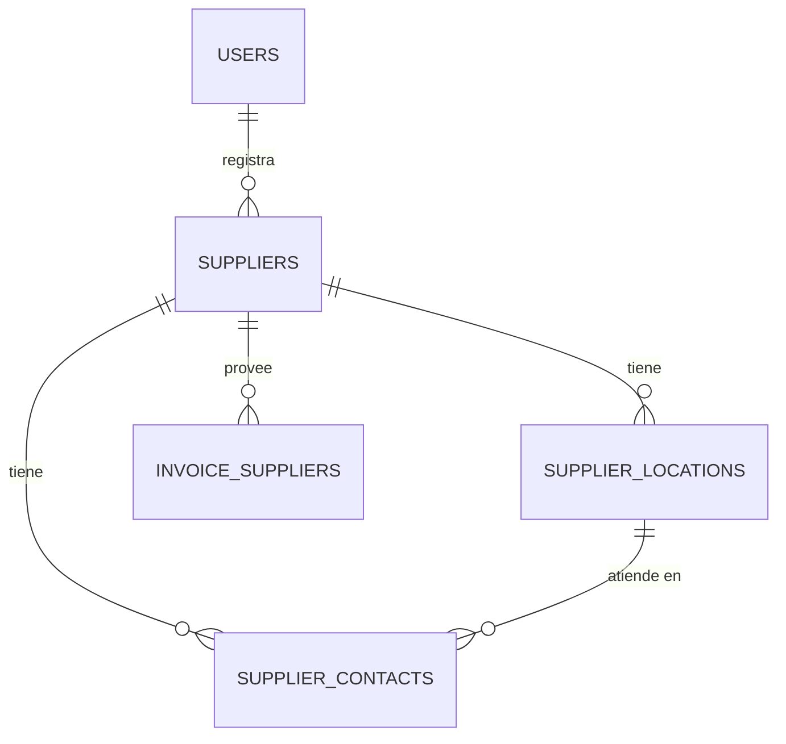

## OBJETO

### Establecer un contrato

No un contrato legal ni comercial, sino un pacto silencioso entre el negocio y su memoria. Un acuerdo que establece qué se recuerda, qué se olvida, qué se puede corregir y qué debe permanecer intocable. Cuando ese contrato se rompe, el sistema deja de ser confiable: se compra a fantasmas, las bodegas de retiro no cuadran con el padrón, los contactos de compra se duplican y el ingreso de mercadería se documenta a ciegas.

Este documento define las estructuras y los flujos que sostienen ese contrato para el registro, edición y baja lógica de **proveedores** (personas naturales o jurídicas), de sus **locales, bodegas y/o puntos de retiro** (con referencia GPS para logística de abastecimiento) y de sus **contactos** (empleados alcanzables a nivel del proveedor o de una sucursal/bodega concreta).

El contrato se apoya en cuatro promesas fundamentales:

1. **Nada se pierde.**  
   La historia de abastecimiento no se borra. Un proveedor que deja de vendernos no desaparece: cambia de estado. Una bodega de retiro sustituida no se destruye: se deshabilita y conserva el rastro de las compras que la usaron.

2. **Nada se falsifica.**  
   Cada compra queda atada a un proveedor real del padrón. Un punto de retiro declara coordenadas GPS y dirección. Un contacto declara a quién se llama para cotizar, despachar o reclamar, con cargo y teléfono. El stock de entrada no inventa orígenes: hereda hechos documentados.

3. **Nada se duplica.**  
   Un RUT/identificador tributario es uno. Una bodega es una. Si el proveedor o el local ya existen —aunque estén deshabilitados—, el sistema los reconoce y los reutiliza en lugar de crear gemelos que ensucien el padrón de compras.

4. **Nada se destruye.**  
   La eliminación física es una tentación peligrosa. Este modelo la reemplaza por estados (`enabled`, `disabled`, `suspended`) que permiten retirar sin romper, ocultar sin olvidar, suspender sin condenar.

Estas promesas no son un lujo técnico. Son la condición para que el negocio pueda confiar en a quién compra, dónde retira y a quién llama.


## CONVENCIONES DEL MODELO

Estas reglas aplican a todas las tablas de este documento y a los tres motores soportados: **MariaDB**, **PostgreSQL** y **SQLite**. Son las mismas convenciones de <a href="#/items/objeto">Artículos</a>, <a href="#/users/objeto">Usuarios</a> y <a href="#/customers/objeto">Clientes</a>.

### Identificadores

Todas las claves primarias y foráneas usan **UUID** en formato canónico minúsculas (`xxxxxxxx-xxxx-4xxx-yxxx-xxxxxxxxxxxx`).

| Motor | Tipo | Default |
|-------|------|---------|
| MariaDB 10.7+ | `CHAR(36)` | `(UUID())` |
| PostgreSQL 13+ | `UUID` | `gen_random_uuid()` |
| SQLite | `TEXT` | expresión UUID v4 (ver abajo) |

Si el motor MariaDB es anterior a esas versiones, el UUID se genera en la aplicación.

**Expresión UUID v4 para SQLite:**

```sql
lower(hex(randomblob(4))) || '-' ||
lower(hex(randomblob(2))) || '-4' ||
substr(lower(hex(randomblob(2))), 2) || '-' ||
substr('89ab', 1 + (abs(random()) % 4), 1) ||
substr(lower(hex(randomblob(2))), 2) || '-' ||
lower(hex(randomblob(6)))
```

### Estado (`status`)

```text
'enabled' | 'disabled' | 'suspended'
```

El campo se llama siempre `status`. La baja es un cambio de estado; la reactivación reutiliza el registro existente.

### Integridad referencial

Las claves foráneas usan `ON DELETE RESTRICT`. Borrar un proveedor en cascada rompería compras (`invoice_suppliers` en el <a href="#/items/objeto">Mantenedor de Artículos</a>) y el historial de abastecimiento.

En SQLite es obligatorio:

```sql
PRAGMA foreign_keys = ON;
```

### Timestamps

| Motor | `created_at` | `updated_at` |
|-------|--------------|--------------|
| MariaDB | `TIMESTAMP NOT NULL DEFAULT CURRENT_TIMESTAMP` | `TIMESTAMP NULL DEFAULT NULL ON UPDATE CURRENT_TIMESTAMP` |
| PostgreSQL | `TIMESTAMPTZ NOT NULL DEFAULT now()` | trigger `set_updated_at()` |
| SQLite | `TEXT NOT NULL DEFAULT (strftime('%Y-%m-%d %H:%M:%S', 'now'))` | trigger por tabla |

**PostgreSQL — función compartida** (crear una sola vez por base):

```sql
CREATE OR REPLACE FUNCTION set_updated_at()
RETURNS trigger AS $$
BEGIN
  NEW.updated_at = now();
  RETURN NEW;
END;
$$ LANGUAGE plpgsql;
```

### Usuario auditor

`user_id` es UUID y referencia `users(id)` (ver <a href="#/users/objeto">Mantenedor de Usuarios</a>). Aquí solo aparece como dependencia de auditoría de alta/edición.

### GPS y logística de abastecimiento

Las coordenadas se almacenan en **WGS84**:

| Campo | Rango | Semántica |
|-------|-------|-----------|
| `latitude` | −90 a 90 | Latitud decimal |
| `longitude` | −180 a 180 | Longitud decimal |

Tipos portables: `DECIMAL(9,6)` / `DECIMAL(10,6)` en MariaDB y PostgreSQL; `REAL` en SQLite con `CHECK` de rango. Un local o bodega **habilitado para retiro/visita** debe tener ambas coordenadas. Rutas de abastecimiento multi-proveedor (secuencia de retiros, flota propia) son una **decisión diferida**: este mantenedor garantiza el padrón georreferenciado.

### Contactos: alcance proveedor vs local

Un contacto pertenece siempre a un `supplier_id`. Opcionalmente apunta a un `location_id`:

- `location_id` **nulo** → contacto del proveedor en general (ventas, administración, cobranza).
- `location_id` **presente** → contacto de esa sucursal/bodega/punto de retiro; el local debe ser del mismo proveedor.

### Simetría con clientes

El padrón de proveedores es el espejo de abastecimiento del padrón de clientes. Misma forma mental (`party_type`, `tax_id`, locales GPS, contactos con alcance), distinto rol en el negocio: aquí el dinero y la mercadería **entran** desde el proveedor; en clientes, **salen** hacia el cliente.

### Decisiones diferidas

- **Rutas de retiro multi-proveedor** (orden de paradas, camiones propios): documento futuro que consumirá `supplier_locations`.
- **Condiciones comerciales** (plazos de pago, listas de precio del proveedor): fuera de este padrón base.
- **Validación tributaria formal del RUT/NIT** por país: la unicidad de `tax_id` es del contrato; el dígito verificador vive en la aplicación.
- **Historial de correcciones** de nombre o dirección: la promesa exige rastro; la tabla de auditoría se definirá aparte.


## PRIMERO: El Modelo



`INVOICE_SUPPLIERS` se define en el <a href="#/items/objeto">Mantenedor de Artículos</a>; aquí solo se declara la dependencia.


## Tabla "suppliers"

### Propósito

Padrón maestro de proveedores: personas **naturales** o **jurídicas** desde las cuales el negocio ingresa mercadería. Es la raíz de abastecimiento que alimenta compras (`invoice_suppliers`), puntos de retiro y contactos de compra.

### Filosofía de diseño

El proveedor es una identidad comercial estable. `party_type` discrimina la naturaleza jurídica sin partir el padrón en dos tablas: así `invoice_suppliers.supplier_id` siempre apunta a un solo lugar.

- **Persona natural:** `name` es el nombre completo del proveedor.
- **Persona jurídica:** `name` es la razón social; `trade_name` (opcional) es el nombre de fantasía.

`tax_id` (RUT, NIT u otro identificador tributario) es único. Si se intenta crear un proveedor cuyo `tax_id` ya existe deshabilitado, el sistema podrá ofrecer reactivarlo.

Los proveedores no se eliminan: `status` pasa a `disabled` o `suspended`, conservando el historial de compras e inventario.

### Descripción de la tabla

| Campo         | Descripción |
|---------------|-------------|
| `id`          | Identificador único (UUID) |
| `party_type`  | `natural` o `legal` |
| `name`        | Nombre completo o razón social |
| `trade_name`  | Nombre de fantasía; nulo si no aplica |
| `tax_id`      | Identificador tributario (único) |
| `email`       | Correo general del proveedor; nulo si no se conoce |
| `notes`       | Observaciones de compra (condiciones, horarios, etc.) |
| `user_id`     | Usuario que creó el registro |
| `created_at`  | Fecha de creación |
| `updated_at`  | Fecha de la última modificación |
| `status`      | `enabled` / `disabled` / `suspended` |

### MariaDB

```sql
CREATE TABLE `suppliers` (
  `id` CHAR(36) NOT NULL DEFAULT (UUID()),
  `party_type` VARCHAR(20) NOT NULL,
  `name` VARCHAR(255) NOT NULL,
  `trade_name` VARCHAR(255) NULL,
  `tax_id` VARCHAR(64) NOT NULL,
  `email` VARCHAR(255) NULL,
  `notes` TEXT NULL,
  `user_id` CHAR(36) NOT NULL,
  `created_at` TIMESTAMP NOT NULL DEFAULT CURRENT_TIMESTAMP,
  `updated_at` TIMESTAMP NULL DEFAULT NULL ON UPDATE CURRENT_TIMESTAMP,
  `status` VARCHAR(20) NOT NULL DEFAULT 'enabled',
  PRIMARY KEY (`id`),
  UNIQUE (`tax_id`),
  CONSTRAINT `suppliers_party_type_check`
    CHECK (`party_type` IN ('natural', 'legal')),
  CONSTRAINT `suppliers_status_check`
    CHECK (`status` IN ('enabled', 'disabled', 'suspended')),
  CONSTRAINT `fk_suppliers_user`
    FOREIGN KEY (`user_id`) REFERENCES `users`(`id`) ON DELETE RESTRICT
);

INSERT INTO `suppliers` (
  `party_type`, `name`, `trade_name`, `tax_id`, `email`, `user_id`
) VALUES
  (
    'legal',
    'Comercial Todo a Mil Ltda.',
    'Todo a Mil',
    '76.987.654-3',
    'ventas@todoamil.example',
    '00000000-0000-4000-8000-000000000001'
  ),
  (
    'natural',
    'Pedro Antonio Núñez Castro',
    NULL,
    '11.222.333-4',
    'pnunez@example.com',
    '00000000-0000-4000-8000-000000000001'
  );
```

### PostgreSQL

```sql
CREATE TABLE suppliers (
  id UUID PRIMARY KEY DEFAULT gen_random_uuid(),
  party_type TEXT NOT NULL
    CHECK (party_type IN ('natural', 'legal')),
  name VARCHAR(255) NOT NULL,
  trade_name VARCHAR(255),
  tax_id VARCHAR(64) NOT NULL,
  email VARCHAR(255),
  notes TEXT,
  user_id UUID NOT NULL REFERENCES users(id) ON DELETE RESTRICT,
  created_at TIMESTAMPTZ NOT NULL DEFAULT now(),
  updated_at TIMESTAMPTZ,
  status TEXT NOT NULL DEFAULT 'enabled'
    CHECK (status IN ('enabled', 'disabled', 'suspended')),
  CONSTRAINT suppliers_tax_id_unique UNIQUE (tax_id)
);

CREATE TRIGGER suppliers_set_updated_at
BEFORE UPDATE ON suppliers
FOR EACH ROW EXECUTE FUNCTION set_updated_at();
```

### SQLite

```sql
CREATE TABLE suppliers (
  id TEXT NOT NULL PRIMARY KEY DEFAULT (
    lower(hex(randomblob(4))) || '-' ||
    lower(hex(randomblob(2))) || '-4' ||
    substr(lower(hex(randomblob(2))), 2) || '-' ||
    substr('89ab', 1 + (abs(random()) % 4), 1) ||
    substr(lower(hex(randomblob(2))), 2) || '-' ||
    lower(hex(randomblob(6)))
  ),
  party_type TEXT NOT NULL
    CHECK (party_type IN ('natural', 'legal')),
  name TEXT NOT NULL,
  trade_name TEXT,
  tax_id TEXT NOT NULL UNIQUE,
  email TEXT,
  notes TEXT,
  user_id TEXT NOT NULL REFERENCES users(id) ON DELETE RESTRICT,
  created_at TEXT NOT NULL DEFAULT (strftime('%Y-%m-%d %H:%M:%S', 'now')),
  updated_at TEXT,
  status TEXT NOT NULL DEFAULT 'enabled'
    CHECK (status IN ('enabled', 'disabled', 'suspended'))
);

CREATE TRIGGER suppliers_set_updated_at
AFTER UPDATE ON suppliers
FOR EACH ROW
WHEN NEW.updated_at IS OLD.updated_at
BEGIN
  UPDATE suppliers
  SET updated_at = strftime('%Y-%m-%d %H:%M:%S', 'now')
  WHERE id = NEW.id;
END;
```

### Drizzle ORM (MariaDB)

```ts
import { mysqlTable, char, varchar, text, timestamp } from 'drizzle-orm/mysql-core';
import { sql } from 'drizzle-orm';

export const suppliers = mysqlTable('suppliers', {
  id: char('id', { length: 36 }).primaryKey().default(sql`(UUID())`),
  partyType: varchar('party_type', { length: 20 }).notNull(),
  name: varchar('name', { length: 255 }).notNull(),
  tradeName: varchar('trade_name', { length: 255 }),
  taxId: varchar('tax_id', { length: 64 }).notNull().unique(),
  email: varchar('email', { length: 255 }),
  notes: text('notes'),
  userId: char('user_id', { length: 36 }).notNull(),
  createdAt: timestamp('created_at').notNull().defaultNow(),
  updatedAt: timestamp('updated_at').onUpdateNow(),
  status: varchar('status', { length: 20 }).notNull().default('enabled'),
});
```


## Tabla "supplier_locations"

### Propósito

Sucursales, oficinas, bodegas y/o puntos de retiro del proveedor. Cada registro es un punto físico donde el negocio puede retirar mercadería, coordinar despachos o visitar al proveedor. Incluye referencia GPS para logística de abastecimiento.

### Filosofía de diseño

Un proveedor puede tener muchas ubicaciones: casa matriz, bodega de despacho, punto de retiro en planta. `location_kind` tipifica el rol:

```text
'branch'    — sucursal u oficina comercial
'warehouse' — bodega / centro de distribución
'pickup'    — punto de retiro acordado
'other'     — otro punto relevante
```

La dirección textual es para humanos; `latitude` / `longitude` alimentan rutas de retiro. Ambos deben coexistir en puntos operativos.

Las ubicaciones no se eliminan. Si el proveedor cierra una bodega, `status` cambia a `disabled` o `suspended`. Las compras históricas siguen resolviendo el punto.

### Descripción de la tabla

| Campo           | Descripción |
|-----------------|-------------|
| `id`            | Identificador único (UUID) |
| `supplier_id`   | Proveedor dueño del punto |
| `name`          | Etiqueta operativa (“Bodega Sur”, “Planta Maipú”) |
| `location_kind` | `branch` / `warehouse` / `pickup` / `other` |
| `address_line`  | Calle, número, depto/oficina |
| `city`          | Comuna o ciudad |
| `region`        | Región / estado / provincia |
| `postal_code`   | Código postal; nulo si no aplica |
| `country_code`  | ISO 3166-1 alpha-2 (`CL`, `AR`, …) |
| `latitude`      | Latitud WGS84 |
| `longitude`     | Longitud WGS84 |
| `pickup_notes`  | Indicaciones de retiro (horario, andén, documentación) |
| `user_id`       | Usuario que creó el registro |
| `created_at`    | Fecha de creación |
| `updated_at`    | Fecha de la última modificación |
| `status`        | Ciclo de vida del punto |

Unicidad: `UNIQUE (supplier_id, name)`.

### MariaDB

```sql
CREATE TABLE `supplier_locations` (
  `id` CHAR(36) NOT NULL DEFAULT (UUID()),
  `supplier_id` CHAR(36) NOT NULL,
  `name` VARCHAR(255) NOT NULL,
  `location_kind` VARCHAR(20) NOT NULL DEFAULT 'warehouse',
  `address_line` VARCHAR(255) NOT NULL,
  `city` VARCHAR(120) NOT NULL,
  `region` VARCHAR(120) NOT NULL,
  `postal_code` VARCHAR(32) NULL,
  `country_code` CHAR(2) NOT NULL DEFAULT 'CL',
  `latitude` DECIMAL(9,6) NOT NULL,
  `longitude` DECIMAL(10,6) NOT NULL,
  `pickup_notes` TEXT NULL,
  `user_id` CHAR(36) NOT NULL,
  `created_at` TIMESTAMP NOT NULL DEFAULT CURRENT_TIMESTAMP,
  `updated_at` TIMESTAMP NULL DEFAULT NULL ON UPDATE CURRENT_TIMESTAMP,
  `status` VARCHAR(20) NOT NULL DEFAULT 'enabled',
  PRIMARY KEY (`id`),
  UNIQUE (`supplier_id`, `name`),
  INDEX `idx_supplier_locations_supplier` (`supplier_id`),
  INDEX `idx_supplier_locations_geo` (`latitude`, `longitude`),
  CONSTRAINT `supplier_locations_kind_check`
    CHECK (`location_kind` IN ('branch', 'warehouse', 'pickup', 'other')),
  CONSTRAINT `supplier_locations_status_check`
    CHECK (`status` IN ('enabled', 'disabled', 'suspended')),
  CONSTRAINT `supplier_locations_lat_check`
    CHECK (`latitude` >= -90 AND `latitude` <= 90),
  CONSTRAINT `supplier_locations_lng_check`
    CHECK (`longitude` >= -180 AND `longitude` <= 180),
  CONSTRAINT `fk_supplier_locations_supplier`
    FOREIGN KEY (`supplier_id`) REFERENCES `suppliers`(`id`) ON DELETE RESTRICT,
  CONSTRAINT `fk_supplier_locations_user`
    FOREIGN KEY (`user_id`) REFERENCES `users`(`id`) ON DELETE RESTRICT
);
```

### PostgreSQL

```sql
CREATE TABLE supplier_locations (
  id UUID PRIMARY KEY DEFAULT gen_random_uuid(),
  supplier_id UUID NOT NULL REFERENCES suppliers(id) ON DELETE RESTRICT,
  name VARCHAR(255) NOT NULL,
  location_kind TEXT NOT NULL DEFAULT 'warehouse'
    CHECK (location_kind IN ('branch', 'warehouse', 'pickup', 'other')),
  address_line VARCHAR(255) NOT NULL,
  city VARCHAR(120) NOT NULL,
  region VARCHAR(120) NOT NULL,
  postal_code VARCHAR(32),
  country_code CHAR(2) NOT NULL DEFAULT 'CL',
  latitude NUMERIC(9,6) NOT NULL
    CHECK (latitude >= -90 AND latitude <= 90),
  longitude NUMERIC(10,6) NOT NULL
    CHECK (longitude >= -180 AND longitude <= 180),
  pickup_notes TEXT,
  user_id UUID NOT NULL REFERENCES users(id) ON DELETE RESTRICT,
  created_at TIMESTAMPTZ NOT NULL DEFAULT now(),
  updated_at TIMESTAMPTZ,
  status TEXT NOT NULL DEFAULT 'enabled'
    CHECK (status IN ('enabled', 'disabled', 'suspended')),
  CONSTRAINT supplier_locations_supplier_name_unique UNIQUE (supplier_id, name)
);

CREATE INDEX idx_supplier_locations_supplier ON supplier_locations (supplier_id);
CREATE INDEX idx_supplier_locations_geo ON supplier_locations (latitude, longitude);

CREATE TRIGGER supplier_locations_set_updated_at
BEFORE UPDATE ON supplier_locations
FOR EACH ROW EXECUTE FUNCTION set_updated_at();
```

### SQLite

```sql
CREATE TABLE supplier_locations (
  id TEXT NOT NULL PRIMARY KEY DEFAULT (
    lower(hex(randomblob(4))) || '-' ||
    lower(hex(randomblob(2))) || '-4' ||
    substr(lower(hex(randomblob(2))), 2) || '-' ||
    substr('89ab', 1 + (abs(random()) % 4), 1) ||
    substr(lower(hex(randomblob(2))), 2) || '-' ||
    lower(hex(randomblob(6)))
  ),
  supplier_id TEXT NOT NULL REFERENCES suppliers(id) ON DELETE RESTRICT,
  name TEXT NOT NULL,
  location_kind TEXT NOT NULL DEFAULT 'warehouse'
    CHECK (location_kind IN ('branch', 'warehouse', 'pickup', 'other')),
  address_line TEXT NOT NULL,
  city TEXT NOT NULL,
  region TEXT NOT NULL,
  postal_code TEXT,
  country_code TEXT NOT NULL DEFAULT 'CL',
  latitude REAL NOT NULL
    CHECK (latitude >= -90 AND latitude <= 90),
  longitude REAL NOT NULL
    CHECK (longitude >= -180 AND longitude <= 180),
  pickup_notes TEXT,
  user_id TEXT NOT NULL REFERENCES users(id) ON DELETE RESTRICT,
  created_at TEXT NOT NULL DEFAULT (strftime('%Y-%m-%d %H:%M:%S', 'now')),
  updated_at TEXT,
  status TEXT NOT NULL DEFAULT 'enabled'
    CHECK (status IN ('enabled', 'disabled', 'suspended')),
  UNIQUE (supplier_id, name)
);

CREATE INDEX idx_supplier_locations_supplier ON supplier_locations (supplier_id);
CREATE INDEX idx_supplier_locations_geo ON supplier_locations (latitude, longitude);

CREATE TRIGGER supplier_locations_set_updated_at
AFTER UPDATE ON supplier_locations
FOR EACH ROW
WHEN NEW.updated_at IS OLD.updated_at
BEGIN
  UPDATE supplier_locations
  SET updated_at = strftime('%Y-%m-%d %H:%M:%S', 'now')
  WHERE id = NEW.id;
END;
```


## Tabla "supplier_contacts"

### Propósito

Personas de contacto vinculadas al proveedor en general o a una sucursal/bodega/punto de retiro concreto. Soportan la operación de compra y abastecimiento: a quién llamar para cotizar, confirmar despacho o coordinar retiro.

### Filosofía de diseño

Un contacto no es un usuario del sistema: es un interlocutor del proveedor. Campos mínimos del contrato:

- **Nombre del empleado** (`full_name`)
- **Cargo** (`job_title`)
- **Número de teléfono** (`phone`)

| Situación | `supplier_id` | `location_id` |
|-----------|---------------|---------------|
| Contacto general del proveedor | obligatorio | `NULL` |
| Contacto de una bodega/sucursal | obligatorio | UUID del local |

Cuando `location_id` está presente, debe pertenecer al mismo `supplier_id` (invariante de aplicación; reforzable con triggers). Los contactos no se eliminan: cambian de `status`.

### Descripción de la tabla

| Campo          | Descripción |
|----------------|-------------|
| `id`           | Identificador único (UUID) |
| `supplier_id`  | Proveedor al que pertenece |
| `location_id`  | Local/bodega; nulo = contacto general |
| `full_name`    | Nombre del empleado / interlocutor |
| `job_title`    | Cargo (Ejecutivo de ventas, Jefe de bodega, etc.) |
| `phone`        | Número de teléfono de contacto |
| `email`        | Correo opcional del contacto |
| `notes`        | Observaciones (horario de llamado, etc.) |
| `user_id`      | Usuario que creó el registro |
| `created_at`   | Fecha de creación |
| `updated_at`   | Fecha de la última modificación |
| `status`       | Ciclo de vida del contacto |

### MariaDB

```sql
CREATE TABLE `supplier_contacts` (
  `id` CHAR(36) NOT NULL DEFAULT (UUID()),
  `supplier_id` CHAR(36) NOT NULL,
  `location_id` CHAR(36) NULL,
  `full_name` VARCHAR(255) NOT NULL,
  `job_title` VARCHAR(120) NOT NULL,
  `phone` VARCHAR(64) NOT NULL,
  `email` VARCHAR(255) NULL,
  `notes` TEXT NULL,
  `user_id` CHAR(36) NOT NULL,
  `created_at` TIMESTAMP NOT NULL DEFAULT CURRENT_TIMESTAMP,
  `updated_at` TIMESTAMP NULL DEFAULT NULL ON UPDATE CURRENT_TIMESTAMP,
  `status` VARCHAR(20) NOT NULL DEFAULT 'enabled',
  PRIMARY KEY (`id`),
  INDEX `idx_supplier_contacts_supplier` (`supplier_id`),
  INDEX `idx_supplier_contacts_location` (`location_id`),
  CONSTRAINT `supplier_contacts_status_check`
    CHECK (`status` IN ('enabled', 'disabled', 'suspended')),
  CONSTRAINT `fk_supplier_contacts_supplier`
    FOREIGN KEY (`supplier_id`) REFERENCES `suppliers`(`id`) ON DELETE RESTRICT,
  CONSTRAINT `fk_supplier_contacts_location`
    FOREIGN KEY (`location_id`) REFERENCES `supplier_locations`(`id`) ON DELETE RESTRICT,
  CONSTRAINT `fk_supplier_contacts_user`
    FOREIGN KEY (`user_id`) REFERENCES `users`(`id`) ON DELETE RESTRICT
);
```

### PostgreSQL

```sql
CREATE TABLE supplier_contacts (
  id UUID PRIMARY KEY DEFAULT gen_random_uuid(),
  supplier_id UUID NOT NULL REFERENCES suppliers(id) ON DELETE RESTRICT,
  location_id UUID REFERENCES supplier_locations(id) ON DELETE RESTRICT,
  full_name VARCHAR(255) NOT NULL,
  job_title VARCHAR(120) NOT NULL,
  phone VARCHAR(64) NOT NULL,
  email VARCHAR(255),
  notes TEXT,
  user_id UUID NOT NULL REFERENCES users(id) ON DELETE RESTRICT,
  created_at TIMESTAMPTZ NOT NULL DEFAULT now(),
  updated_at TIMESTAMPTZ,
  status TEXT NOT NULL DEFAULT 'enabled'
    CHECK (status IN ('enabled', 'disabled', 'suspended'))
);

CREATE INDEX idx_supplier_contacts_supplier ON supplier_contacts (supplier_id);
CREATE INDEX idx_supplier_contacts_location ON supplier_contacts (location_id);

CREATE TRIGGER supplier_contacts_set_updated_at
BEFORE UPDATE ON supplier_contacts
FOR EACH ROW EXECUTE FUNCTION set_updated_at();
```

### SQLite

```sql
CREATE TABLE supplier_contacts (
  id TEXT NOT NULL PRIMARY KEY DEFAULT (
    lower(hex(randomblob(4))) || '-' ||
    lower(hex(randomblob(2))) || '-4' ||
    substr(lower(hex(randomblob(2))), 2) || '-' ||
    substr('89ab', 1 + (abs(random()) % 4), 1) ||
    substr(lower(hex(randomblob(2))), 2) || '-' ||
    lower(hex(randomblob(6)))
  ),
  supplier_id TEXT NOT NULL REFERENCES suppliers(id) ON DELETE RESTRICT,
  location_id TEXT REFERENCES supplier_locations(id) ON DELETE RESTRICT,
  full_name TEXT NOT NULL,
  job_title TEXT NOT NULL,
  phone TEXT NOT NULL,
  email TEXT,
  notes TEXT,
  user_id TEXT NOT NULL REFERENCES users(id) ON DELETE RESTRICT,
  created_at TEXT NOT NULL DEFAULT (strftime('%Y-%m-%d %H:%M:%S', 'now')),
  updated_at TEXT,
  status TEXT NOT NULL DEFAULT 'enabled'
    CHECK (status IN ('enabled', 'disabled', 'suspended'))
);

CREATE INDEX idx_supplier_contacts_supplier ON supplier_contacts (supplier_id);
CREATE INDEX idx_supplier_contacts_location ON supplier_contacts (location_id);

CREATE TRIGGER supplier_contacts_set_updated_at
AFTER UPDATE ON supplier_contacts
FOR EACH ROW
WHEN NEW.updated_at IS OLD.updated_at
BEGIN
  UPDATE supplier_contacts
  SET updated_at = strftime('%Y-%m-%d %H:%M:%S', 'now')
  WHERE id = NEW.id;
END;
```


## Flujos

### Alta de proveedor

1. Capturar `party_type`, `name`, `tax_id` (y `trade_name` si es jurídica).  
2. Si `tax_id` ya existe `enabled` → rechazo.  
3. Si existe `disabled`/`suspended` → ofrecer reactivación.  
4. Insertar `suppliers` con `user_id` del operador.

### Alta de local / bodega / punto de retiro

1. Elegir proveedor `enabled`.  
2. Registrar etiqueta, tipo, dirección textual y GPS.  
3. Opcional: `pickup_notes` para el chofer o el encargado de retiro.  
4. Insertar `supplier_locations`.

### Alta de contacto

1. Elegir proveedor.  
2. Si el contacto es de una bodega/sucursal, elegir `location_id` de ese proveedor; si es general, dejar nulo.  
3. Registrar `full_name`, `job_title`, `phone`.  
4. Insertar `supplier_contacts`.

### Baja lógica

Cambiar `status` del proveedor, del local o del contacto. Un proveedor `disabled` no debería aceptarse en nuevas compras; sus puntos GPS siguen disponibles para auditoría.

### Consulta — proveedor con puntos de retiro habilitados

```sql
SELECT
  s.id AS supplier_id,
  s.name AS supplier_name,
  s.trade_name,
  s.tax_id,
  l.id AS location_id,
  l.name AS location_name,
  l.location_kind,
  l.address_line,
  l.city,
  l.region,
  l.latitude,
  l.longitude,
  l.pickup_notes
FROM suppliers s
JOIN supplier_locations l ON l.supplier_id = s.id
WHERE s.status = 'enabled'
  AND l.status = 'enabled'
ORDER BY s.name, l.name;
```

### Consulta — puntos GPS en una caja geográfica (ventana de retiros)

```sql
SELECT
  l.id,
  s.name AS supplier_name,
  l.name AS location_name,
  l.location_kind,
  l.latitude,
  l.longitude,
  l.address_line,
  l.city
FROM supplier_locations l
JOIN suppliers s ON s.id = l.supplier_id
WHERE l.status = 'enabled'
  AND s.status = 'enabled'
  AND l.latitude BETWEEN :lat_min AND :lat_max
  AND l.longitude BETWEEN :lng_min AND :lng_max;
```

### Consulta — contactos de un proveedor (generales y por local)

```sql
SELECT
  ct.id,
  ct.full_name,
  ct.job_title,
  ct.phone,
  ct.email,
  CASE
    WHEN ct.location_id IS NULL THEN 'supplier'
    ELSE 'location'
  END AS scope,
  l.name AS location_name
FROM supplier_contacts ct
LEFT JOIN supplier_locations l ON l.id = ct.location_id
WHERE ct.supplier_id = :supplier_id
  AND ct.status = 'enabled'
ORDER BY scope, l.name, ct.full_name;
```

### Consulta — a quién llamar en un punto de retiro

```sql
SELECT
  ct.full_name,
  ct.job_title,
  ct.phone,
  ct.email
FROM supplier_contacts ct
WHERE ct.location_id = :location_id
  AND ct.status = 'enabled'
ORDER BY ct.full_name;
```


## Orden de migración sugerido

1. `users` (<a href="#/users/objeto">Mantenedor de Usuarios</a>)  
2. `suppliers`  
3. `supplier_locations`  
4. `supplier_contacts`  
5. Consumidores externos: `invoice_suppliers` (<a href="#/items/objeto">Mantenedor de Artículos</a>), futuro motor de rutas de retiro  

## Relación con otros mantenedores

| Mantenedor | Uso de este padrón |
|------------|--------------------|
| <a href="#/items/objeto">Artículos</a> | `invoice_suppliers.supplier_id` → `suppliers.id` |
| <a href="#/users/objeto">Usuarios</a> | `user_id` de auditoría en altas |
| <a href="#/customers/objeto">Clientes</a> | Espejo conceptual (venta vs compra); no comparten filas |
| Futuro: rutas de retiro | Consume `supplier_locations` (GPS + notas) y `supplier_contacts` |
