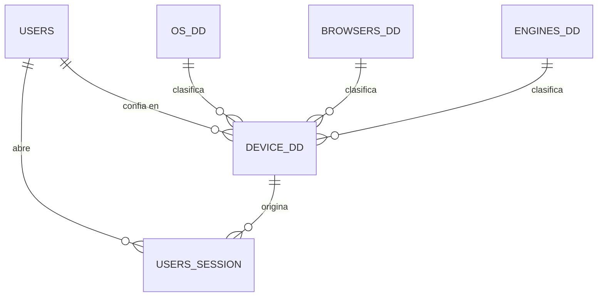

## OBJETO

### Establecer un contrato

No un contrato legal ni comercial, sino un pacto silencioso entre el negocio y su memoria. Un acuerdo que establece qué se recuerda, qué se olvida, qué se puede corregir y qué debe permanecer intocable. Cuando ese contrato se rompe, el sistema deja de ser confiable: las sesiones se falsifican, los dispositivos de confianza se vuelven opacos y las decisiones de acceso se toman a ciegas.

Este documento define las estructuras y los flujos que sostienen ese contrato para el registro, autenticación y desconexión de usuarios, la protección y recuperación de contraseñas, la validación y el cambio de correo electrónico, la individualización de dispositivos de confianza y el registro de sesiones.

El contrato se apoya en cuatro promesas fundamentales:

1. **Nada se pierde.**  
   La historia de acceso no se borra. Un usuario que deja de operar no desaparece: cambia de estado (`active`). Un nombre o correo mal escrito no se sobrescribe sin control: se corrige con validación.

2. **Nada se falsifica.**  
   Cada inicio de sesión queda atado a un usuario, a un dispositivo y a un token. El stock de confianza del dispositivo no es una opinión: es el resultado de un hecho de verificación (`device_dd.active`).

3. **Nada se duplica.**  
   Un correo es un correo. Un dispositivo de confianza es un dispositivo. Si algo ya existe —aunque esté deshabilitado—, el sistema lo reconoce y lo reutiliza.

4. **Nada se destruye.**  
   La eliminación física de usuarios y dispositivos es una tentación peligrosa. Este modelo la reemplaza por estados en `users.active` (`enabled`, `disabled`, `suspended`) y por la marca de confianza en `device_dd.active` (0 / 1).

Estas promesas no son un lujo técnico. Son la condición para que el negocio pueda confiar en quién actúa en su nombre digital.


## CONVENCIONES DEL MODELO

Formato multi-motor alineado al <a href="#/items/objeto">Mantenedor de Artículos</a>, sin renombrar las columnas del contrato de usuarios.

### Identificadores

Todas las claves primarias y foráneas usan **UUID** canónico minúsculas.

| Motor | Tipo | Default |
|-------|------|---------|
| MariaDB 10.7+ | `CHAR(36)` | `(UUID())` |
| PostgreSQL 13+ | `UUID` | `gen_random_uuid()` |
| SQLite | `TEXT` | expresión UUID v4 |

**Expresión UUID v4 para SQLite:**

```sql
lower(hex(randomblob(4))) || '-' ||
lower(hex(randomblob(2))) || '-4' ||
substr(lower(hex(randomblob(2))), 2) || '-' ||
substr('89ab', 1 + (abs(random()) % 4), 1) ||
substr(lower(hex(randomblob(2))), 2) || '-' ||
lower(hex(randomblob(6)))
```

### Estado y confianza (como en el documento original)

| Tabla | Campo | Valores |
|-------|-------|---------|
| `users` | `active` | `enabled` / `disabled` / `suspended` |
| `device_dd` | `active` | `0` = inválido / no confiable (default); `1` = válido / confiable |

### Integridad referencial

`ON DELETE RESTRICT` en FKs. En SQLite: `PRAGMA foreign_keys = ON;`.

### Timestamps

| Motor | `created_at` | `updated_at` (cuando exista) |
|-------|--------------|------------------------------|
| MariaDB | `TIMESTAMP NOT NULL DEFAULT CURRENT_TIMESTAMP` | `TIMESTAMP NULL DEFAULT NULL ON UPDATE CURRENT_TIMESTAMP` |
| PostgreSQL | `TIMESTAMPTZ NOT NULL DEFAULT now()` | trigger `set_updated_at()` si la tabla tiene `updated_at` |
| SQLite | `TEXT NOT NULL DEFAULT (strftime('%Y-%m-%d %H:%M:%S', 'now'))` | trigger por tabla si aplica |

**PostgreSQL — función compartida:**

```sql
CREATE OR REPLACE FUNCTION set_updated_at()
RETURNS trigger AS $$
BEGIN
  NEW.updated_at = now();
  RETURN NEW;
END;
$$ LANGUAGE plpgsql;
```

### Detector de dispositivos

La individualización del cliente se apoya en [Device Detector](https://github.com/matomo-org/device-detector). Los catálogos `os_dd`, `browsers_dd` y `engines_dd` se precargan desde esa librería. Aquí van el esquema y ejemplos; el seed completo puede vivir en un script de datos.

### Decisiones diferidas (del autor)

- Segundo factor (p. ej. Authy) para confirmar dispositivos.
- Analíticas de acceso.


## PRIMERO: El Modelo



Alcance:

1. Registro  
2. Acceso (login)  
3. Recuperación de contraseña  
4. Cambio de contraseña  
5. Validación de e-mail  
6. Cambio de e-mail  
7. Desconexión  
8. Analíticas — diferido  


## Tabla "users"

### Propósito

Almacenamiento de los usuarios del sistema.

### Descripción de la tabla

| Campo            | Descripción |
|------------------|-------------|
| `id`             | Identificador único (UUID) |
| `email`          | Correo electrónico (único) |
| `email_verified` | Indica si el e-mail está validado (`0` / `1`) |
| `password`       | Contraseña del usuario |
| `created_at`     | Fecha de creación |
| `updated_at`     | Fecha de la última modificación |
| `active`         | Estado: `enabled` / `disabled` / `suspended` |

### MariaDB

```sql
CREATE TABLE `users` (
  `id` CHAR(36) NOT NULL DEFAULT (UUID()),
  `email` VARCHAR(255) NOT NULL,
  `email_verified` TINYINT(1) NOT NULL DEFAULT 0,
  `password` VARCHAR(255) NOT NULL,
  `created_at` TIMESTAMP NOT NULL DEFAULT CURRENT_TIMESTAMP,
  `updated_at` TIMESTAMP NULL DEFAULT NULL ON UPDATE CURRENT_TIMESTAMP,
  `active` ENUM('suspended', 'disabled', 'enabled') NOT NULL DEFAULT 'enabled',
  PRIMARY KEY (`id`),
  UNIQUE (`email`)
);

INSERT INTO `users` (`email`, `password`) VALUES (
  'root@example.com',
  '$argon2id$v=19$m=65536,t=4,p=1$q48Yhp6RvNmPaHsrwRFj5A$xrZv7aCfhUlaXloD0yxHNH+QnXvGW/BmyIdv7vYZ314'
);
```

### PostgreSQL

```sql
CREATE TABLE users (
  id UUID PRIMARY KEY DEFAULT gen_random_uuid(),
  email VARCHAR(255) NOT NULL,
  email_verified SMALLINT NOT NULL DEFAULT 0
    CHECK (email_verified IN (0, 1)),
  password VARCHAR(255) NOT NULL,
  created_at TIMESTAMPTZ NOT NULL DEFAULT now(),
  updated_at TIMESTAMPTZ,
  active TEXT NOT NULL DEFAULT 'enabled'
    CHECK (active IN ('suspended', 'disabled', 'enabled')),
  CONSTRAINT users_email_unique UNIQUE (email)
);

CREATE TRIGGER users_set_updated_at
BEFORE UPDATE ON users
FOR EACH ROW EXECUTE FUNCTION set_updated_at();
```

### SQLite

```sql
CREATE TABLE users (
  id TEXT NOT NULL PRIMARY KEY DEFAULT (
    lower(hex(randomblob(4))) || '-' ||
    lower(hex(randomblob(2))) || '-4' ||
    substr(lower(hex(randomblob(2))), 2) || '-' ||
    substr('89ab', 1 + (abs(random()) % 4), 1) ||
    substr(lower(hex(randomblob(2))), 2) || '-' ||
    lower(hex(randomblob(6)))
  ),
  email TEXT NOT NULL UNIQUE,
  email_verified INTEGER NOT NULL DEFAULT 0
    CHECK (email_verified IN (0, 1)),
  password TEXT NOT NULL,
  created_at TEXT NOT NULL DEFAULT (strftime('%Y-%m-%d %H:%M:%S', 'now')),
  updated_at TEXT,
  active TEXT NOT NULL DEFAULT 'enabled'
    CHECK (active IN ('suspended', 'disabled', 'enabled'))
);

CREATE TRIGGER users_set_updated_at
AFTER UPDATE ON users
FOR EACH ROW
WHEN NEW.updated_at IS OLD.updated_at
BEGIN
  UPDATE users
  SET updated_at = strftime('%Y-%m-%d %H:%M:%S', 'now')
  WHERE id = NEW.id;
END;
```


## Tabla "os_dd"

### Propósito

Listado de sistemas operativos que contiene Device Detector. `os_dd` = *Operative System Device Detector*.

### Descripción de la tabla

| Campo | Descripción |
|-------|-------------|
| `id`  | Identificador único (UUID) |
| `os`  | Nombre del sistema operativo (único) |

### MariaDB

```sql
CREATE TABLE `os_dd` (
  `id` CHAR(36) NOT NULL DEFAULT (UUID()),
  `os` VARCHAR(250) NOT NULL,
  PRIMARY KEY (`id`),
  UNIQUE (`os`)
);

INSERT INTO `os_dd` (`os`) VALUES
  ('Android'), ('GNU/Linux'), ('Windows'), ('iOS'), ('Mac'), ('iPadOS');
```

### PostgreSQL

```sql
CREATE TABLE os_dd (
  id UUID PRIMARY KEY DEFAULT gen_random_uuid(),
  os VARCHAR(250) NOT NULL,
  CONSTRAINT os_dd_os_unique UNIQUE (os)
);
```

### SQLite

```sql
CREATE TABLE os_dd (
  id TEXT NOT NULL PRIMARY KEY DEFAULT (
    lower(hex(randomblob(4))) || '-' ||
    lower(hex(randomblob(2))) || '-4' ||
    substr(lower(hex(randomblob(2))), 2) || '-' ||
    substr('89ab', 1 + (abs(random()) % 4), 1) ||
    substr(lower(hex(randomblob(2))), 2) || '-' ||
    lower(hex(randomblob(6)))
  ),
  os TEXT NOT NULL UNIQUE
);
```


## Tabla "browsers_dd"

### Propósito

Listado de navegadores web que contiene Device Detector.

### Descripción de la tabla

| Campo     | Descripción |
|-----------|-------------|
| `id`      | Identificador único (UUID) |
| `browser` | Nombre del navegador (único) |

### MariaDB

```sql
CREATE TABLE `browsers_dd` (
  `id` CHAR(36) NOT NULL DEFAULT (UUID()),
  `browser` VARCHAR(250) NOT NULL,
  PRIMARY KEY (`id`),
  UNIQUE (`browser`)
);

INSERT INTO `browsers_dd` (`browser`) VALUES
  ('Chrome'), ('Firefox'), ('Safari'), ('Microsoft Edge'), ('Brave');
```

### PostgreSQL

```sql
CREATE TABLE browsers_dd (
  id UUID PRIMARY KEY DEFAULT gen_random_uuid(),
  browser VARCHAR(250) NOT NULL,
  CONSTRAINT browsers_dd_browser_unique UNIQUE (browser)
);
```

### SQLite

```sql
CREATE TABLE browsers_dd (
  id TEXT NOT NULL PRIMARY KEY DEFAULT (
    lower(hex(randomblob(4))) || '-' ||
    lower(hex(randomblob(2))) || '-4' ||
    substr(lower(hex(randomblob(2))), 2) || '-' ||
    substr('89ab', 1 + (abs(random()) % 4), 1) ||
    substr(lower(hex(randomblob(2))), 2) || '-' ||
    lower(hex(randomblob(6)))
  ),
  browser TEXT NOT NULL UNIQUE
);
```


## Tabla "engines_dd"

### Propósito

Listado de motores de renderizado que contiene Device Detector.

### Descripción de la tabla

| Campo    | Descripción |
|----------|-------------|
| `id`     | Identificador único (UUID) |
| `engine` | Nombre del motor (único) |

### MariaDB

```sql
CREATE TABLE `engines_dd` (
  `id` CHAR(36) NOT NULL DEFAULT (UUID()),
  `engine` VARCHAR(250) NOT NULL,
  PRIMARY KEY (`id`),
  UNIQUE (`engine`)
);

INSERT INTO `engines_dd` (`engine`) VALUES
  ('Blink'), ('Gecko'), ('WebKit'), ('Edge');
```

### PostgreSQL

```sql
CREATE TABLE engines_dd (
  id UUID PRIMARY KEY DEFAULT gen_random_uuid(),
  engine VARCHAR(250) NOT NULL,
  CONSTRAINT engines_dd_engine_unique UNIQUE (engine)
);
```

### SQLite

```sql
CREATE TABLE engines_dd (
  id TEXT NOT NULL PRIMARY KEY DEFAULT (
    lower(hex(randomblob(4))) || '-' ||
    lower(hex(randomblob(2))) || '-4' ||
    substr(lower(hex(randomblob(2))), 2) || '-' ||
    substr('89ab', 1 + (abs(random()) % 4), 1) ||
    substr(lower(hex(randomblob(2))), 2) || '-' ||
    lower(hex(randomblob(6)))
  ),
  engine TEXT NOT NULL UNIQUE
);
```

### Consulta — resolver IDs desde nombres detectados

```sql
SELECT
  b.id AS browser_id,
  o.id AS os_id,
  e.id AS engine_id
FROM browsers_dd b
JOIN os_dd o ON o.os = 'GNU/Linux'
JOIN engines_dd e ON e.engine = 'Gecko'
WHERE b.browser = 'Firefox';
```


## Tabla "device_dd"

### Propósito

Individualiza el dispositivo desde el cual el usuario está realizando la conexión, detectando el sistema operativo, el navegador y el motor. El usuario valida el dispositivo (p. ej. por correo) y lo confirma como dispositivo de confianza. Queda pendiente un segundo factor (p. ej. Authy).

### Descripción de la tabla

| Campo        | Descripción |
|--------------|-------------|
| `id`         | Identificador único (UUID) |
| `name`       | Nombre asignado por el usuario |
| `user_id`    | Identificador del usuario |
| `browser_id` | Identificador del navegador (`browsers_dd`) |
| `os_id`      | Identificador del sistema operativo (`os_dd`) |
| `engine_id`  | Identificador del motor (`engines_dd`) |
| `ip`         | Dirección IP |
| `created_at` | Tiempo de creación del dispositivo |
| `active`     | `0` = inválido / no confiable (default); `1` = válido / confiable |

### MariaDB

```sql
CREATE TABLE `device_dd` (
  `id` CHAR(36) NOT NULL DEFAULT (UUID()),
  `name` VARCHAR(250) NOT NULL,
  `user_id` CHAR(36) NOT NULL,
  `browser_id` CHAR(36) NOT NULL,
  `os_id` CHAR(36) NOT NULL,
  `engine_id` CHAR(36) NOT NULL,
  `ip` VARCHAR(45) NOT NULL,
  `created_at` TIMESTAMP NOT NULL DEFAULT CURRENT_TIMESTAMP,
  `active` TINYINT(1) NOT NULL DEFAULT 0,
  PRIMARY KEY (`id`),
  INDEX `idx_device_dd_user` (`user_id`),
  CONSTRAINT `fk_device_dd_user`
    FOREIGN KEY (`user_id`) REFERENCES `users`(`id`) ON DELETE RESTRICT,
  CONSTRAINT `fk_device_dd_browser`
    FOREIGN KEY (`browser_id`) REFERENCES `browsers_dd`(`id`) ON DELETE RESTRICT,
  CONSTRAINT `fk_device_dd_os`
    FOREIGN KEY (`os_id`) REFERENCES `os_dd`(`id`) ON DELETE RESTRICT,
  CONSTRAINT `fk_device_dd_engine`
    FOREIGN KEY (`engine_id`) REFERENCES `engines_dd`(`id`) ON DELETE RESTRICT
);
```

### PostgreSQL

```sql
CREATE TABLE device_dd (
  id UUID PRIMARY KEY DEFAULT gen_random_uuid(),
  name VARCHAR(250) NOT NULL,
  user_id UUID NOT NULL REFERENCES users(id) ON DELETE RESTRICT,
  browser_id UUID NOT NULL REFERENCES browsers_dd(id) ON DELETE RESTRICT,
  os_id UUID NOT NULL REFERENCES os_dd(id) ON DELETE RESTRICT,
  engine_id UUID NOT NULL REFERENCES engines_dd(id) ON DELETE RESTRICT,
  ip VARCHAR(45) NOT NULL,
  created_at TIMESTAMPTZ NOT NULL DEFAULT now(),
  active SMALLINT NOT NULL DEFAULT 0
    CHECK (active IN (0, 1))
);

CREATE INDEX idx_device_dd_user ON device_dd (user_id);
```

### SQLite

```sql
CREATE TABLE device_dd (
  id TEXT NOT NULL PRIMARY KEY DEFAULT (
    lower(hex(randomblob(4))) || '-' ||
    lower(hex(randomblob(2))) || '-4' ||
    substr(lower(hex(randomblob(2))), 2) || '-' ||
    substr('89ab', 1 + (abs(random()) % 4), 1) ||
    substr(lower(hex(randomblob(2))), 2) || '-' ||
    lower(hex(randomblob(6)))
  ),
  name TEXT NOT NULL,
  user_id TEXT NOT NULL REFERENCES users(id) ON DELETE RESTRICT,
  browser_id TEXT NOT NULL REFERENCES browsers_dd(id) ON DELETE RESTRICT,
  os_id TEXT NOT NULL REFERENCES os_dd(id) ON DELETE RESTRICT,
  engine_id TEXT NOT NULL REFERENCES engines_dd(id) ON DELETE RESTRICT,
  ip TEXT NOT NULL,
  created_at TEXT NOT NULL DEFAULT (strftime('%Y-%m-%d %H:%M:%S', 'now')),
  active INTEGER NOT NULL DEFAULT 0
    CHECK (active IN (0, 1))
);

CREATE INDEX idx_device_dd_user ON device_dd (user_id);
```


## Tabla "UsersSession"

### Propósito

Registra el inicio de sesión del usuario, proveyendo un token de seguridad de la sesión.

### Descripción de la tabla

| Campo        | Descripción |
|--------------|-------------|
| `id`         | Identificador único (UUID) |
| `user_id`    | Identificador del usuario |
| `token`      | Token generado para una validación futura |
| `device`     | Id del dispositivo conectado (`device_dd.id`) |
| `created_at` | Tiempo de creación de la sesión |

### MariaDB

```sql
CREATE TABLE `UsersSession` (
  `id` CHAR(36) NOT NULL DEFAULT (UUID()),
  `user_id` CHAR(36) NOT NULL,
  `token` VARCHAR(250) NOT NULL,
  `device` CHAR(36) NOT NULL,
  `created_at` TIMESTAMP NOT NULL DEFAULT CURRENT_TIMESTAMP,
  PRIMARY KEY (`id`),
  INDEX `idx_UsersSession_user` (`user_id`),
  INDEX `idx_UsersSession_device` (`device`),
  CONSTRAINT `fk_UsersSession_user`
    FOREIGN KEY (`user_id`) REFERENCES `users`(`id`) ON DELETE RESTRICT,
  CONSTRAINT `fk_UsersSession_device`
    FOREIGN KEY (`device`) REFERENCES `device_dd`(`id`) ON DELETE RESTRICT
);
```

### PostgreSQL

```sql
CREATE TABLE "UsersSession" (
  id UUID PRIMARY KEY DEFAULT gen_random_uuid(),
  user_id UUID NOT NULL REFERENCES users(id) ON DELETE RESTRICT,
  token VARCHAR(250) NOT NULL,
  device UUID NOT NULL REFERENCES device_dd(id) ON DELETE RESTRICT,
  created_at TIMESTAMPTZ NOT NULL DEFAULT now()
);

CREATE INDEX idx_UsersSession_user ON "UsersSession" (user_id);
CREATE INDEX idx_UsersSession_device ON "UsersSession" (device);
```

### SQLite

```sql
CREATE TABLE UsersSession (
  id TEXT NOT NULL PRIMARY KEY DEFAULT (
    lower(hex(randomblob(4))) || '-' ||
    lower(hex(randomblob(2))) || '-4' ||
    substr(lower(hex(randomblob(2))), 2) || '-' ||
    substr('89ab', 1 + (abs(random()) % 4), 1) ||
    substr(lower(hex(randomblob(2))), 2) || '-' ||
    lower(hex(randomblob(6)))
  ),
  user_id TEXT NOT NULL REFERENCES users(id) ON DELETE RESTRICT,
  token TEXT NOT NULL,
  device TEXT NOT NULL REFERENCES device_dd(id) ON DELETE RESTRICT,
  created_at TEXT NOT NULL DEFAULT (strftime('%Y-%m-%d %H:%M:%S', 'now'))
);

CREATE INDEX idx_UsersSession_user ON UsersSession (user_id);
CREATE INDEX idx_UsersSession_device ON UsersSession (device);
```


## Flujos

### Registro

1. Formulario: correo + contraseña.  
2. Se inserta en `users` con `email_verified = 0` y `active = 'enabled'`.  
3. Se solicita validación del e-mail (canal fuera de este esquema de tablas).

### Acceso (login)

1. Formulario: correo + contraseña.  
2. Device Detector obtiene SO, navegador y motor; se resuelven IDs en `os_dd`, `browsers_dd`, `engines_dd`.  
3. Se localiza o crea `device_dd` (`active = 0` hasta confirmar confianza).  
4. Si las credenciales son válidas y `users.active = 'enabled'`, se inserta `UsersSession` (`token`, `device`).  
5. Confirmación del dispositivo de confianza (correo u otro canal; segundo factor diferido).

### Recuperación de contraseña

Como en el documento original:

1. Enlace “¿Olvidó su contraseña?” en el formulario de acceso.  
2. El usuario escribe el correo y solicita recuperación.  
3. Se envía un código al correo.  
4. El usuario ingresa el código.  
5. Escribe la nueva contraseña dos veces; mensaje de confirmación.  
6. (Detalle de almacenamiento del código: pendiente de completar en el contrato, como en el original.)

### Cambio de contraseña

Usuario autenticado: valida la contraseña actual y actualiza `users.password`.

### Validación de e-mail

Tras confirmar el correo, `users.email_verified = 1`.

### Cambio de e-mail

Usuario autenticado: solicita cambio, confirma el nuevo correo y actualiza `users.email` (y `email_verified` según el flujo de confirmación).

### Desconexión

```sql
DELETE FROM UsersSession
WHERE id = :session_id;
```

Cerrar todas las sesiones del usuario:

```sql
DELETE FROM UsersSession
WHERE user_id = :user_id;
```

### Consulta — sesiones de un usuario

```sql
SELECT
  s.id,
  s.token,
  s.created_at,
  d.name AS device_name,
  d.ip,
  b.browser AS browser,
  o.os AS os
FROM UsersSession s
JOIN device_dd d ON d.id = s.device
JOIN browsers_dd b ON b.id = d.browser_id
JOIN os_dd o ON o.id = d.os_id
WHERE s.user_id = :user_id
ORDER BY s.created_at DESC;
```


## Orden de migración sugerido

1. `users`  
2. `os_dd`, `browsers_dd`, `engines_dd` (+ seed Device Detector)  
3. `device_dd`  
4. `UsersSession`  

## Relación con otros mantenedores

| Mantenedor | Uso |
|------------|-----|
| <a href="#/items/objeto">Artículos</a> | `user_id` de auditoría en catálogo, documentos e inventario |
| <a href="#/customers/objeto">Clientes</a> | `user_id` en altas |
| <a href="#/suppliers/objeto">Proveedores</a> | `user_id` en altas |
